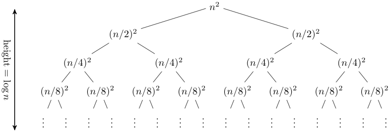

# 递归与动态规划

## 递归

- 线性递归（减治）
- 二分递归（分治）

### 递归分析

#### 递归跟踪

#### 递推方程

$T(n) = T(n-1) + O(1) = T(n-1) + c_1$

$T(0) = O(1) = c_2$

$T(n) = c_1 n + c_2 = O(n)$

#### 递归树

#### 主定理

设有递推式 $T(n) = aT(\frac{n}{b})+f(n)，a \ge 1，b > 1$。

##### 情形一

若存在常数 $\epsilon > 0$，有 $f(n) = O(n^{\log_b{a}-\epsilon})$（多项式地小于），则 $T(n) = \Theta(n^{\log_b{a}})$。

##### 情形二

若存在常数 $k \ge 0$，有 $f(n) = \Theta(n^{\log_b{a}} \log^k{n})$，则 $T(n) = \Theta(n^{\log_b{a}} \log^{k+1}{n})$。

##### 情形三

如存在常数 $\epsilon > 0$，有 $f(n) = \Omega(n^{\log_b{a}+\epsilon})$（多项式地大于），同时存在常数 $c < 1$，以及充分大的 $n$，满足 $af(\frac{n}{b}) \le cf(n)$，则 $T(n) = \Theta(f(n))$。

### 递归消除

- 使用迭代（易于消除尾递归）
- 使用栈结构模拟递归调用

## 动态规划

TODO
