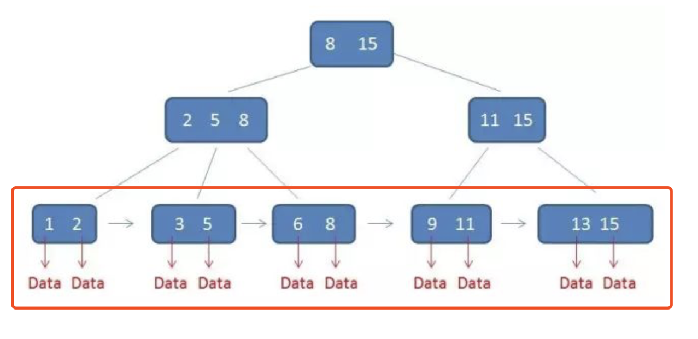
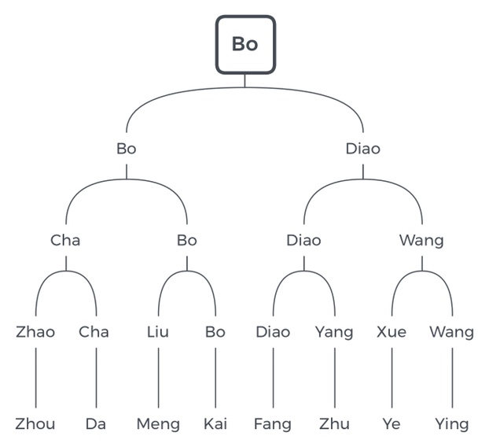

# 扩展

## 图

### 双连通域分解

## 查找

### 红黑树

### k-d 树

### B+ 树

常用于数据库和文件系统。

### 跳跃列表

## 堆

### 左偏树

## 字符串匹配

### BM 算法

### Karp-Rabin 算法

## 排序

### k 选取

### 希尔排序

又称递减增量排序，每次对间隔为 k 的一组元素排序，即将序列交替分为 k 组分别排序，然后递减 k（有多种增量序列），重复操作，直到 k 为 1 时，相当于对整个数组直接排序。

由于经过多轮迭代后，整个数组大致有序，故最终使用插入排序将会接近线性时间。使用优化的增量序列可使希尔排序整体的复杂度降低至 $O(n \log^2 n)$、$O(n^{7/6})$ 级别。

由于相同元素可能被分到不同的组，故希尔排序是不稳定的。

### 锦标赛排序/胜者树

最下面两行节点是 8 个归并段，对它们的开头元素两两比较，**取胜者作为父节点**，直到根节点“Bo”，因此输出“Bo”，同时从第 4 个归并段移除“Bo”，取下一个元素“Kai”，**不断与其兄弟节点比较，更新父节点为新的胜者**，直到根节点，如此反复。

若某个归并段已空，则将其标记为“\*”，“\*”与任何关键码比较都是败者。

### 败者树

最下面两行节点是 8 个归并段，对它们的开头元素两两比较，**取败者作为父节点，胜者继续和兄弟分支的胜者比较**，继续取败者作为更高一层的父节点，直到根节点时，败者为“Diao”，胜者为“Bo”，因此输出“Bo”，同时从第 4 个归并段移除“Bo”，取下一个元素“Kai”，**不断与父节点比较（注意这里不需要和兄弟节点比较），若胜出则继续向上比较，若败北则停下取代当前父节点，胜者继续向上比较**，直到根节点，如此反复。

若某个归并段已空，则将其标记为“\*”，“\*”与任何关键码比较都是败者。

败者树相比胜者树来说，更充分地利用了先前的比较结果，每次输出后，不需要从底向上更新整条路径上的节点，而是仅在父节点（先前的败者）胜出时，才需要更新该节点，因此减少了交换操作。从树的结构来看，可以发现上述优势的根源在于胜者树将败者丢在了较低层，较高层却充斥着重复的胜者，当胜者输出后这些节点将没有价值，而反观败者树，内部节点是没有重复元素的，高层保存着先前的败者，因此每次读入新关键码之后可以不断向上比较，且只在必要的时候才需要更新沿途节点。（2019 年清华 912 真题）

### 外部排序

#### 多路归并排序

对于外部归并排序而言，增加归并路数 m（一次归并的归并段数量）可减少归并趟数，从而减少 I/O 次数。然而同时，增加归并路数也增加了每次选择最小关键码所需时间（$O(m)$），因此增大到一定程度可能适得其反。为了进一步提高归并路数，可利用胜者树或败者树等结构将选择最小关键码的时间缩短到 $O(\log m)$。

#### 置换-选择排序

用于外部排序中生成初始归并段。

步骤：

1. 读入 w 个记录到 WA（工作区）
2. 从 WA 中选出最小者，记为 MIN
3. 输出 MIN
4. 若为读入完，则再读入下一个记录到 WA
5. 从 WA 中选出大于 MIN 的最小者，作为新的 MIN
6. 重复 3～5，直到 WA 中没有比 MIN 大的记录为止，输出一个归并段结束标志
7. 重复 2～6，直到 WA 为空

#### 最佳归并树

一个普通的归并树：

其中，各叶节点表示参加归并的初始归并段，叶节点上的权值表示该归并段上的记录数，各非叶节点表示归并成的新归并段。归并树的带权路径长度 WPL 为归并过程中总的读记录次数。上图中 WPL 为 9+30+12+18+3+17+2+6+24+51+38+32=242，从而总的 I/O 次数为 $2 \times WPL = 484$。

要减小 WPL，需要优化归并方案，可以采用 Huffman 编码树的构造策略，不断选取最短的 m 个归并段进行归并，如下：

如果初始归并段数量不能恰好构成严格的 m 叉树，需要添加长度为 0 的“虚段”。
