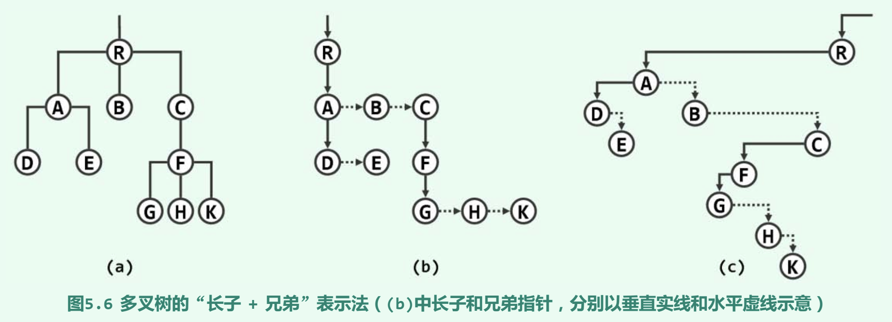

# 树与二叉树

## 概念和表示

### 树

- 等价于连通无环图
    - 每一节点与根节点都有一条路径相连
    - 由根节点通往每个节点的路径唯一
- 路径是从上向下的，同一父节点的孩子之间不存在路径
- 树的路径长度是所有路径长度的总和

### 二叉树

- 每个节点的度数不超过 2
- 非空二叉树的叶子节点数等于度为 2 的节点数加 1，即 $n_0 = n_2 + 1$
- 不含 1 度节点的二叉树称为真二叉树

### 多叉树

#### “父节点”表示法

- 使用向量或列表
- 每个元素保存节点本身的信息和父节点的秩或位置
- 便于自下向上地确定任一节点的父节点（常数时间）
- 查找任一节点的孩子节点需要遍历所有节点（线性时间）

#### “孩子节点”表示法

- 每个元素以向量或列表形式保存孩子节点的秩或位置
- 便于访问任一节点的所有孩子节点

#### “父节点 + 孩子节点”表示法

- 每个元素不仅保存父节点的秩或位置，还保存所有孩子节点的秩或位置
- 兼顾了对父节点和孩子节点的定位
- 缺点是在需要频繁插入删除元素时，维护结构消耗太大

#### 有序多叉树 -> 二叉树：“长子 + 兄弟”表示法



## 二叉树的遍历

### 先序遍历

递归版：

```cpp
void traverse_pre(Node *x) {
    if (!x) return;
    visit(x->data);
    traverse_pre(x->lchild);
    traverse_pre(x->rchild);
}
```

```cpp
void traverse_pre_iter(Node *x) {
    Stack<Node *> S;
    while (x || !S.empty()) {
        if (x) {
            visit(x->data);
            S.push(x);
            x = x->lchild;
        } else {
            x = S.pop()->rchild;
        }
    }
}
```

### 中序遍历

递归版：

```cpp
void traverse_in(Node *x) {
    if (!x) return;
    traverse_in(x->lchild);
    visit(x->data);
    traverse_in(x->rchild);    
}
```

迭代版：

```cpp
void traverse_in_iter(Node *x) {
    Stack<Node *> S;
    while (x || !S.empty()) {
        if (x) {
            S.push(x);
            x = x->lchild;
        } else {
            x = S.pop();
            visit(x->data);
            x = x->rchild;
        }
    }
}
```

### 后序遍历

递归版：

```cpp
void traverse_post(Node *x) {
    if (!x) return;
    traverse_post(x->lchild);
    traverse_post(x->rchild);
    visit(x->data);
}
```

迭代版：

```cpp
// TODO
```

### 层序遍历

```cpp
void traverse_level(Node *x) {
    if (!x) return;

    Queue<Node *> Q;
    Q.enqueue(x);
    while (!Q.empty()) {
        Node *n = Q.dequeue();
        visit(n->data);
        if (n->lchild) Q.enqueue(n->lchild);
        if (n->rchild) Q.enqueue(n->rchild);
    }  
}
```

## 前缀无歧义编码（PFC）

算法逻辑：

1. 初始化 PFC 森林：将每个字符看作一个单节点二叉树，构造一个森林（具体存储方式无所谓，可以用向量，带权的可以用优先队列）
2. 构造 PFC 编码树：从 PFC 森林中不断的取两棵树合并，再放回森林，直到森林中只有一棵树，即 PFC 编码树（不同的选取算法会生成不同的 PFC 编码树）
3. 生成 PFC 编码表：遍历 PFC 编码树的所有从根节点到叶节点的路径，放入字典结构
4. 编码：依次从 PFC 编码表中获得每个字符对应的编码串，拼接
5. 解码：从 PFC 编码树的树根开始，依次根据每个编码字符是 0 或 1 来分别深入左、右子树，直到叶节点则完成一个原字符的解码

上面解码过程中，扫描无需回溯，属于在线算法。

### 最优编码树

- 平均编码长度：编码树中叶节点的平均深度
- 最优二叉编码树：平均编码长度最小
    - 双子性：所有内部节点都是 2 度节点（若不然，则用唯一的孩子取代 1 度节点，可以使平均编码长度减小）
    - 层次性：叶节点深度之差不超过 1（若不然，设 $depth(x) - depth(y) \ge 2$，则 $depth(x.parent) - depth(y) \ge 1$，交换 x.parent 和 y，则 x 及其兄弟节点的编码长度全部减 1，y 的编码长度和 x.parent 互换，总体上平均编码长度减小）
- 构造算法：建立一棵规模为 $2|\Sigma|-1$ 的完全二叉树，再将 $\Sigma$ 中的字符任意分配给叶节点

### 最优带权编码树

- 带权平均编码长度：编码树中叶节点的带权平均深度（权重可以是字符在文本中的出现频率）
- 最优带权编码树：带权平均编码长度最小
    - 层次性：若字符 x 和 y 的出现频率在所有字符中最低，则必存在某棵最优带权编码树，使 x 和 y 在其中同处于最底层，且互为兄弟（若不然，可以取最底层的一对兄弟叶节点 a、b，分别与 x、y 互换，由于 x、y 权重最小，交换后，带权平均编码长度不会增加，此时仍然是最优带权编码树）

#### Huffman 编码树

算法逻辑：在 PFC 编码树构造算法中，每次取森林中权重最小的两棵树合并。

**Huffman 编码树只是最优带权编码树中的一棵。**
