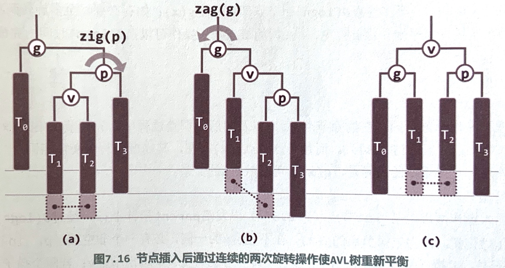
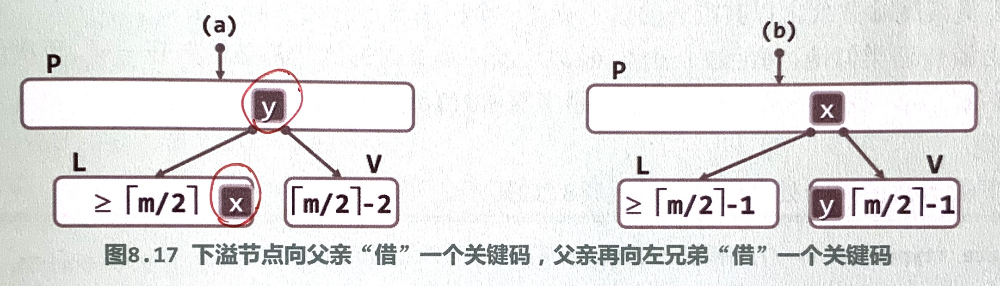
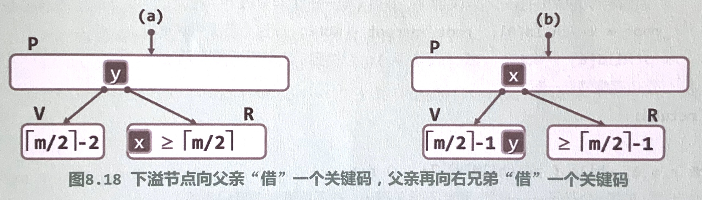
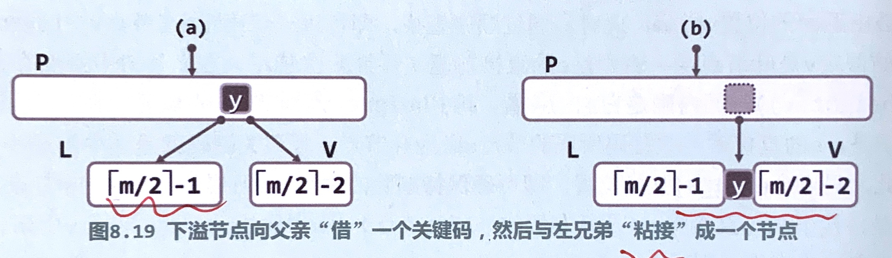

# 搜索树

## 概念

- 键值存储（循关键码访问）
- 要求 key 可比较大小

## 二叉搜索树 BST

- 顺序性：任一节点的左子树不大于该节点，右子树不小于该节点，即，中序遍历序列单调非降。

### 基本操作

下面三个主要算法的最好情况复杂度都是 $O(1)$（根节点处命中），最坏都是 $\Omega(n)$（退化为线性表）。

| 操作 | 算法描述 |
| --- | --- |
| 查找 | 从根节点开始依次比较，小于则向左深入，大于则向右深入 |
| 插入 | 使用上面查找算法找到插入位置（必在叶节点处），插入节点 |
| 删除 | 使用上面查找算法找到待删节点，若只有一个子树，则直接用该子树的根替换待删节点；若有两个子树，则将其与右子树中的最小（左）节点互换，这时将必只有右子树，按前面的方法删除 |

## 平衡二叉搜索树 BBST

### 对 BST 的分析

随机生成：由 n 个关键码的任意一个排列（共 n! 种），依次调用 `insert(e)`，所得到的 BST，称作由该排列“随机生成”。由随机生成得到 BST 的平均树高为 $\Theta(\log{n})$。

随机组成：在遵守顺序性的条件下，随机确定节点间的拓扑连接，称为“随机组成”。由随机组成得到的 BST 的平均树高为 $\Theta(\sqrt{n})$

随机生成相比随机组成，重复统计了多种排列生成相同 BST 的情况。

### 适度平衡

- 将树高限制为渐进地不超过 $O(\log n)$
- 通过等价变换（旋转、重组，保持顺序性）调整树高
- 经过单次修正操作后，至多只有 $O(\log n)$ 处局部不再满足限制条件
- 可在 $O(\log n)$ 时间内使上述局部重新满足限制条件

### 旋转调整

- 经过 zig、zag 操作之后，参与旋转的两个节点深度发生变化，这一局部的子树（乃至全树）高度可能变化，但幅度不超过一层

## AVL 树

- 平衡因子（左右子树高度差）不超过 1
- 有序的完全二叉树必为 AVL 树
- 平衡性：高度为 h 的 AVL 树至少包含 $fib(h+3)-1$ 个节点，反过来，包含 n 个节点的 AVL 树高为 $O(\log n)$

### 插入

插入节点 x 后，失衡节点集 UT 中的节点都是 x 的祖先，且高度不低于 x 的祖父，记其中最深者为 g，p 为 g 的更高的子节点（若等高优先取与 g 同向），v 为 p 的更高的子节点（若等高优先取与 p 同向），x 必然在 v 子树上（x 可能就是 v）。

单旋：

双旋：

上述单旋和双旋最终都将 g 的高度恢复到原高度，除了这个局部之外，没有其它地方的需要再进行重平衡。因此，在 AVL 树中插入新节点，至多需要两次旋转即可恢复平衡。

复杂度：插入新节点 $O(\log n)$，向上检查平衡性（寻找 g）$O(\log n)$，旋转恢复平衡 $O(1)$，总计 $O(\log n)$。

### 删除

按 BST 的方法删除节点 x 后，失衡节点集 UT 中始终至多包含一个节点，若该节点 g 存在，其高度必与失衡前相同（画示意图容易得出）。g 有可能是 x 的父节点。

g 不包含 x 的的一侧，必有非空孩子 p，且 p 子树至少有一个孩子，取 v 为 p 孩子中更高者（若等高则取与 p 同向）。

单旋：

双旋：

这里虚线相连的灰色方块表示不能同时为空，没有连线的灰色方块表示可能为空也可能非空。

注意，单旋时，如果 T2 底部的灰色方块为空，则旋转后，g、p、v 这个局部的子树整体高度减小了 1；双旋时，g、p、v 局部子树高度必然减小 1。**因此，经过一次旋转后，失衡可能会向上传播，需要不断向上寻找失衡节点，进行重平衡，直到树根。**

复杂度：除了由于失衡向上传播需要多花时间重平衡外，其它与插入相同，总体仍然 $O(\log n)$。

### 统一重平衡算法（3+4 重构）

用于将单旋和双旋操作统一，将上述旋转中涉及到的 3 个节点、4 棵子树，按中序遍历次序重新排列和连接。实现起来更加方便。

## 伸展树 Splay Tree

- 利用数据局部性：
    - 刚刚访问过的节点，极有可能在不久之后再次访问
    - 将被访问的下一个节点，极有可能在不久前访问的节点附近

### 逐层伸展

每访问过一个节点后，反复以其父节点为轴做旋转，将其提升为树根。

最坏情况下，每次都放问到最深的叶子结点，退化为 $\Omega(n)$。

问题根源在于，树高最快以算术级数的速度减小。

### 双层伸展

每访问过一个节点 v 后，每次伸展时，根据其父节点 p 和祖父节点 g 的相对位置进行旋转，将 v 提升到原来其祖父节点 g 的位置，重复直到树根。

- zig-zig/zag-zag（注意这种旋转和 AVL 树中的操作不太相同）
- zig-zag/zag-zig
- zig/zag（父节点为根的情况）

旋转时可用 3+4 重构。

优势在于，树高以几何级数（大致折半）的速度减小。单次操作分摊时间 $O(\log n)$。

## B 树

- m 阶 B 树 = m 路平衡搜索树
- 所有外部节点深度相同（可能存在于更低层次的存储系统中）
- 每个内部节点有不超过 m-1 个关键码（不超过 m 个分支）
- 除根节点外，每个内部节点有至少 $\lceil m/2 \rceil - 1$ 个关键码（至少 $\lceil m/2 \rceil$ 个分支）
- 非空 B 树的根节点有至少两个分支
- 一个节点的所有关键码和子节点指针分别组织为两个向量

### 查找

与 BST 类似，区别在于每个节点中需要顺序地（或二分地，但速度提升不大，因为主要时间消耗在访问外存）比较该节点中的所有关键码。

对于高度为 h 的 B 树，外存访问不超过 $O(h-1)$ 次（$h = \Theta(\log_m{n})$）；m 取 256～1024 时，可降低大约一个数量级的外存访问次数。

### 插入

与 BST 类似，区别在于将插入到关键码向量的对应位置，并在子节点指针向量相应位置插入 NULL 右分支。

当节点关键码增加到 m 个时（分支增加到 m+1 个），发生上溢，将第 $s = \lfloor m/2 \rfloor$ 个关键码提升到父节点（或提升为新的根节点），两侧的关键码分裂为两个分支。

提升关键码到父节点可能造成上溢的向上传递，重复上述解决方案，直到上溢不再传递。

复杂度为 $O(\log_m{n})$。

### 删除

首先查找得到关键码 e 所属的节点 v，若 v 不是叶节点，则将 e 与 v 的右分支中的最小关键码 u[0]（在 v 的右分支最左下角，是其直接后继）互换。

此时可确保 e 所属的节点 v 是叶节点（非外部节点），从 v 中删除 e 及其下两个外部节点之一。

当节点 v 的关键码减少到 $\lceil m/2 \rceil - 2$ 个时（分支减少到 $\lceil m/2 \rceil - 1$），发生下溢，需要分三种情况处理（分别对应下面三个示意图）：

- v 的左兄弟节点 L 存在，且至少包含 $\lceil m/2 \rceil$ 个关键码（$\lceil m/2 \rceil + 1$ 个分支）：顺时针旋转 L 的最大关键码、父节点的对应关键码
- v 的右兄弟节点 R 存在，且至少包含 $\lceil m/2 \rceil$ 个关键码（$\lceil m/2 \rceil + 1$ 个分支）：与上一种情况对称
- L 或 R 不存在，或所包含关键码均不足 $\lceil m/2 \rceil$：将父节点对应关键码下降，合并 L（或 R）与 v
 

对于上面第三种情形，下溢可能会向上传递，重复上述解决方案，直到上溢不再传递。

若非空 B 树根节点只剩一个分支（没有关键码），则删除根节点，将唯一的孩子作为新的根节点。

复杂度为 $O(\log_m{n})$。
