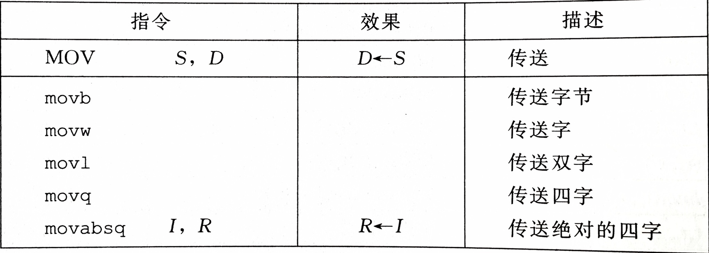
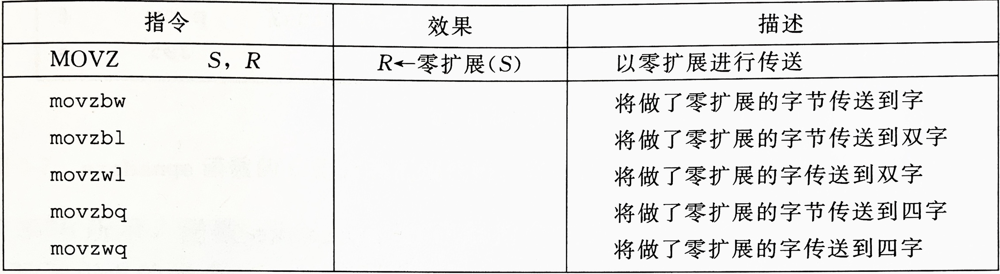
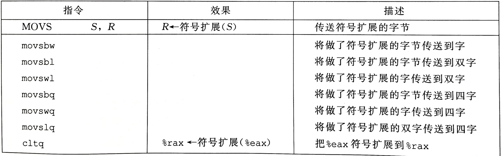
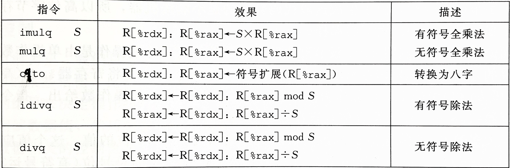
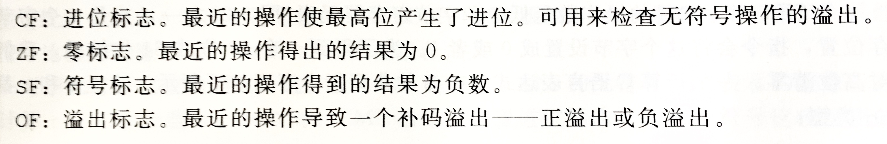
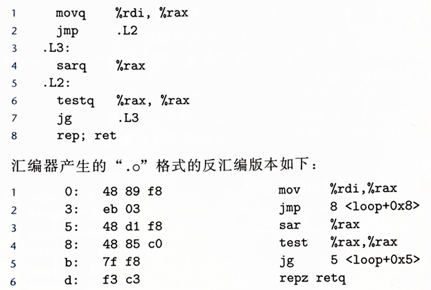

# 第3章 程序的机器级表示

## 寄存器和基本指令

### 通用寄存器


### 寻址模式


### 数据传送指令



`movl` 会把目标寄存器的高 4 字节设为 0。实际上任何更新低 4 字节的指令都会把高 4 字节置 0。

### 零扩展数据传送指令



没有 `movzlq`，因为 `movl` 功能相同。

### 符号扩展数据传送指令



### 栈操作指令


`%rsp` 始终指向栈顶元素。

### 算术操作指令


`leaq` 是 `movq` 的变形，看起来像是从内存中读数据到寄存器，但实际上将算出来的内存地址放到寄存器。

移位指令的移位量可以是一个立即数或 $%cl$ 寄存器（单字节）。

### 特殊的算术操作指令



注意这里的乘法指令是单操作数的，并且是全乘法，而前面的是双操作数。

## 控制

### 常用的条件码



### 比较和测试指令


其中，`cmp` 指令和 `sub` 指令对状态寄存器的修改完全一致（注意两个操作数的顺序），但不会修改目标寄存器；`test` 指令和 `and` 指令对状态寄存器的修改完全一致，但不会修改目标寄存器。

### `set` 指令


`set` 指令的目标操作数只能是低位单字节寄存器（`%al` 等）或一个字节的内存地址，要产生 32 位或 64 位结果，需使用 `movzbl` 等指令进行零扩展。

注意不同 `set` 指令适用的数据类型（有符号、无符号）。

### 跳转指令


跳转指令的 PC 相对寻址：



反汇编第 2 行（地址 0x3）处的跳转指令编码中相对偏移 0x03 加上该指令的下一条指令开始地址 0x5 即为跳转目标地址 0x8；反汇编第 5 行（地址 0xb）处的跳转指令编码中相对偏移 0xf8（补码）加上下一条指令开始地址 0xd 即为跳转目标地址 0x5。

### 使用条件控制实现条件分支

```
if (test-expr)
    then-statement
else
    else-statement
```

翻译为

```
    t = test-expr;
    if (!t)
        goto false;
    then-statement
    goto done;
false:
    else-statement
done:
```

关于分支预测错误处罚的计算：设预测错误的概率为 p，没有预测成功情况下执行时间 Tok，预测错误的处罚是 Tmp，平均执行时间 Tavg(p) = (1-p)\*Tok + p\*(Tok+Tmp) = Tok + p\*Tmp，随机情况下执行时间 Tran = Tavg(0.5) = Tok + 0.5\*tmp。

### 使用条件传送实现条件分支

```
v = test-expr ? then-expr : else-expr
```

翻译为

```
v = then-expr;
ve = else-expr;
t = test-expr;
if (!t) v = ve;
```

条件传送指令：


不是所有条件表达式都可以用条件传送来实现，因为使用条件传送的翻译方法要求对 then 和 else 表达式都求值，如果这两个表达式有副作用，则会出错，例如 `xp ? *xp : 0`。

## 值得注意的题目

所有
