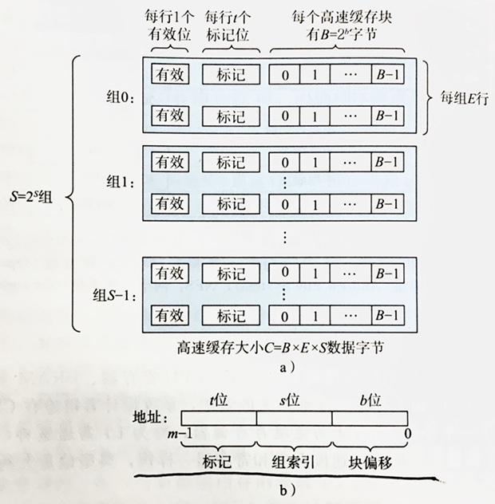
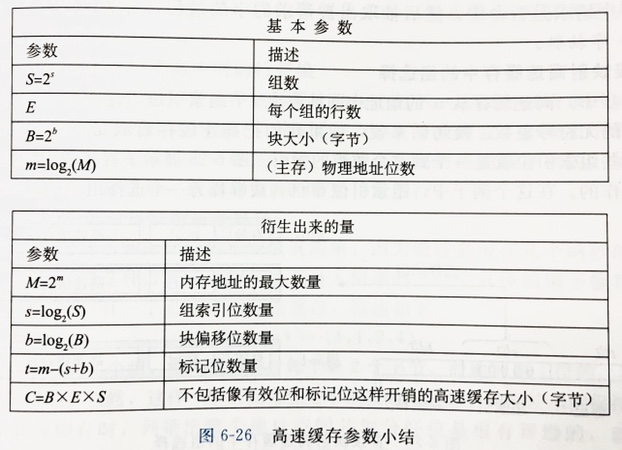

# 第6章 存储器层次结构

## 存储技术

### SRAM

双稳态，只要有电，就会保持它的值，受到干扰后可以自动恢复稳态。

### DRAM

每个位对应一个电容的充电，对干扰很敏感，不能自动恢复状态，必须周期性的读出重新写入来刷新，或者使用纠错码。

#### DRAM 芯片

芯片中的单元（位）分成 d 个超单元，每个超单元由 w 个单元组成，超单元组织成 r 行 c 列的阵列（d=rc）。

内存控制器一次可以传送 w 位到每个 DRAM 芯片或从每个 DRAM 芯片传出 w 位。读超单元需要两步，先发行地址 i，称 RAS（行访问选通脉冲），这时 DRAM 芯片把第 i 行整个复制到内部行缓冲区，然后再发列地址 j，称 CAS，这时 DRAM 芯片从行缓冲区中复制出指定超单元的内容。RAS 和 CAS 共享一根地址线，所以必须分两步发送。

#### 内存模块

多个 DRAM 芯片（这里以 8 个为例）同时连到内存控制器，在读字的时候，内存控制器算出字地址对应的超单元地址 (i, j)，然后同时向 8 个 DRAM 芯片发送读取请求，读到的 8 个超单元（这里以 8 位超单元为例）合并为一个 64 位字。

### 磁盘

磁盘构造：

$磁盘容量 = \frac{字节数}{扇区} \times \frac{平均扇区数}{磁道} \times \frac{磁道数}{盘面} \times \frac{盘面数}{盘片} \times \frac{盘片数}{磁盘}$。

#### 磁盘读写

任何时刻，读写头都位于同一个柱面上。

访问时间包括：

- 寻道时间：平均寻道时间 $T_{avgseek}$ 通常为 3～9ms，最大寻道时间 $T_{maxseek}$ 可高达 20ms。
- 旋转时间：最大旋转时间 $T_{maxrot} = \frac{1}{RPM} \times \frac{60s}{1min}$，平均旋转时间 $T_{avgrot}$ 是 $T_{maxrot}$ 的一半。
- 传送时间：一个扇区的平均传送时间 $T_{avgtrans} = \frac{1}{平均扇区数/磁道} \times \frac{1}{RPM} \times \frac{60s}{1min}$，传送时间实际上就是访问完所有要读的扇区所需的旋转时间。当要读取的扇区很少时，几乎可以忽略不计。

#### 逻辑磁盘块

现代磁盘对外呈现为连续的逻辑块，以扇区为单位，磁盘控制器维护逻辑块号和物理磁盘扇区之间的映射。

#### DMA

CPU 给磁盘控制器发出读命令后，不再需要 CPU 干涉，磁盘控制器可以自行读写总线，将读出的内容直接送入内存，称为 DMA（直接内存访问）。直到读取完成再通过中断通知 CPU。

### 固态硬盘

基于闪存。由 B 个块的序列组成，每个块由 P 页组成。数据读写以页为单位，只有在一页所属的块整个被擦除之后，才能写这一页。在大约进行 100000 次重复写之后，块就会磨损坏，从而不能再使用。

## 高速缓存

示例：

参数：

### 写策略

当要写一个已经缓存了的字 w 时（写命中），在 cache 更新后，更新 w 在更低一层的存储器中的副本的方法：

- 直写（write-through）：立即将 w 写到低一层中。优点是简单，缺点是每次写都会引起总线流量。
- 写回（write-back）：尽可能推迟更新，只有当替换算法要驱逐这个更新过的块时，才写入到低一层。优点是能利用局部性，显著减少总线流量，缺点是增加了复杂性，需要维护一个修改位（dirty bit）。

写不命中的处理方法：

- 写分配（write-allocate）：加载相应的低一层的块到 cache，然后更新这个 cache 块。优点是能利用写的空间局部性，缺点是每次不命中都会导致一个一个块从低一层传送到 cache。
- 非写分配（non-write-allocate）：避开 cache，直接把这个字写到低一层中。

直写策略通常和非写分配策略搭配（特点是都立即写低一层），写回策略通常和写分配策略搭配（特点是都优先写 cache，推迟写低一层）。

### 真实处理器的高速缓存

- i-cache：只缓存指令
- d-cache：只缓存数据
- 统一的高速缓存：即缓存指令也缓存数据

L1 缓存通常是区分 i-cache 和 d-cache 的，L2 和 L3 通常是统一的。区分 i-cache 和 d-cache 可以使处理器能够同时读一个指令字和一个数据字，并且可以针对不同的访问模式来优化这两个 cache，可以有不同的参数，除此之外，还可以确保指令访问和数据访问不会造成冲突不命中；代价是可能会引起容量不命中。

### 高速缓存参数对性能的影响

Cache 大小的影响：

- 较大的容量可能提高命中率
- 较大的容量可能导致较慢的速度，增加命中时间

块大小的影响：

- 较大的块能利用空间局部性，提高命中率
- Cache 总大小固定时，块更大意味着行数更少，损害时间局部性比空间局部性更好的程序中的命中率
- 较大的块导致更高的不命中惩罚，因为块越大传送所需时间越大

相联度的影响：

- 较高的相联度降低了由于冲突不命中出现抖动的可能性
- 较高的相联度需要较高的成本，每一行需要额外的标记位和控制逻辑
- 较高的相联度会增加命中时间和不命中惩罚，因为匹配逻辑和选择牺牲行的逻辑更复杂
- 通常会在不命中惩罚较低的地方使用较低的相联度，比如 L1 cache；在不命中惩罚较高的地方使用较高的相联度，比如虚拟内存

写策略的影响：

- 直写策略比较容易实现；能使用独立与 cache 的写缓冲区来更新内存；读不命中开销较小，因为不会触发额外的内存写
- 写回策略引起的内存和 cache 之间的数据传送较少，允许更多的内存的带宽用于执行 DMA 的 I/O 设备
- 层次结构越往下，传送时间增加，越可能使用写回而不是直写

## 值得注意的题目

P410-6.3、P411-6.4、P433-6.11、P436-6.13-6.14-6.15-6.16、P442-6.17-6.18-6.19-6.20、P447-6.21
