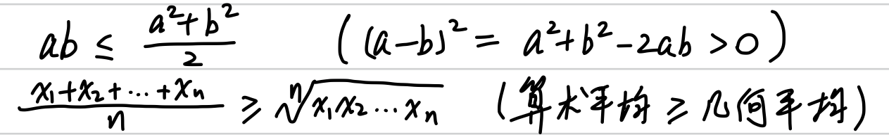

# 函数、极限、连续

## 题型

### ✅ 求函数极限、无穷小比阶、给出极限求参数

- 等价无穷小代换
- 去绝对值符号，分别求两侧极限
- 洛必达法则（只能在极限确实存在的情况下使用）
- 泰勒公式
- 化数列极限为函数极限

### ✅ 求间断点及其类型

- 找出**所有**无定义点
- 分别求左右极限

### ✅ 判断/证明函数连续性、给出连续条件求参数

- 求分界点处左右极限
- 🤔 使用夹逼定理
    - 1800：P98.44

### ✅ 求反函数

- 直接反推
- 利用奇偶性列出方程求解
    - 1800：P98.49

### ✅ 证明零点存在

- 介值定理/零点定理
- 极限保号性    

### 🤔 数列和的极限

- 定积分定义（凑出 $\frac{i}{n} 和 \frac{1}{n}$）
    - 1800：P99.50.(1)
- 放缩（局部放缩）+ 夹逼定理
    - 1800：P9.61、P9.65、P98.35、P99.50.(2)、P99.54
- 单位区间积分再求和
    - 1800：P98.39、P99.52
- 列项相消
    - 1000：1.75、1.76

### 🤔 数列积的极限

- 合并乘积项（二倍角公式等）
    - 1800：P8.59
- 拆分为数列和（对数等）
    - 1800：P9.63、P9.64、P9.66

### 🤔 给出数列递推式证明收敛并求极限

单调有界数列必有极限，关键在于证明单调和有界。

1800：P4.15、P10.96、P10.97、P10.98、P10.99、P98.39、P98.40、P98.41、P98.43、P99.55

#### 单调性

- 判断 $a_{n+1} - a_n$ 的正负
- 由递推式得出 $a_{n+1} \ge (或 \le) a_n$
- 根据递推式设函数，导数大于等于 0 则单调（可用微分中值定理证明）

#### 有界性

- 根据前若干项设出上下界，利用归纳法证明
- 对递推式放缩（利用常见不等式）
- 极限保号性
- 反证法

## 公式定理

### 等价无穷小

### 常用放缩

$$\frac{1}{n+1} \le \frac{1}{n+\frac{i}{n}} \le \frac{1}{n}$$

$$\frac{1}{n+1} \le \frac{1}{n+\frac{1}{i}} \le \frac{1}{n}$$

$$n(1+\frac{i^2}{n^2}) \le n+\frac{i^2+1}{n} = n(1+\frac{i^2+1}{n^2}) \le n(1+\frac{(i+1)^2}{n^2})$$

$$\sum\limits_{k=1}^n \int_{k}^{k+1} \frac{1}{x} dx \le \sum\limits_{k=1}^n \frac{1}{k} \le 1 + \sum\limits_{k=2}^n \int_{k-1}^k \frac{1}{x} dx$$

$$4 \le (2^n + 3^n + 4^n)^\frac{1}{n} \le (3 \cdot 4^n)^\frac{1}{n}$$

$$\frac{i}{n^2+n+n} \le \frac{i}{n^2+n+i} \le \frac{i}{n^2+n+1}$$

### 常用不等式

### 选择题常用反例

#### $f(x)$ 是偶函数，但原函数 $F(x)$ 不是奇函数

$$f(x) = \cos x, F(x) = \sin x + C (C \ne 0)$$

#### $f(x)$ 是周期函数，但原函数 $F(x)$ 不是周期函数

$$f(x) = \cos^2 x, F(x) = \frac{1}{2} x + \frac{1}{4} \sin{2x} + C$$

#### $f(x)$ 单调增，但原函数 $F(x)$ 不单调增

$$f(x) = -\frac{1}{x}, F(x) = -\ln{x}$$
