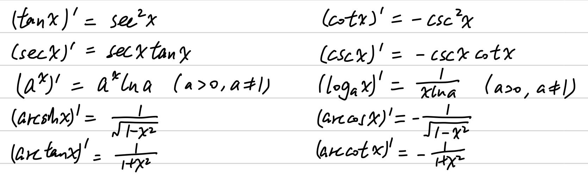

# 一元函数微分学

## 题型

### ✅ 求导、隐函数导数

- 求导公式
- 复合函数求导法
- 对数求导法
- 隐函数求导公式（$y'(x) = -\frac{F'_x}{F'_y}$）

### ✅ 讨论具体函数的单调性、极值点、凹凸性、拐点

1800：P21.45

- 求导判断正负得单调性
- 求二阶导数判断正负得凹凸性
- 注意极值点和拐点是二维平面上的点（不同于间断点，后者是一维数轴上的点）

### ✅ 求函数渐近线

1800：P18.7、P19.17、P21.45、P100.17

- 求间断点处的极限得铅直渐近线
- 求无穷远处的极限得水平渐近线（注意 $+\infty$ 和 $-\infty$ 可能不同，利用奇偶性有时可以只需求其中之一）
- 分别求 $\lim\limits_{x \to \infty} \frac{f(x)}{x} = k$ 和 $\lim\limits_{x \to \infty} [f(x)-kx] = b$ 得 $y=kx+b$（注意 $+\infty$ 和 $-\infty$ 可能不同）

### ✅ 判断函数在某点的可导性及导函数连续性、给出可导条件求参数

1800：P12.13、P14.25、P16.47、P103.47、P103.48、P104.50

- 分别求**左右导数**，都存在且相等则可导
- 分别求**左侧导数的右极限和右侧导数的左极限**，等于分界点处的导数则导函数连续
- 利用导数存在和连续的定义式列方程求解

### ✅ 给出抽象函数可导条件求极限

1800：P99.7、P100.20

- 利用导数定义
- 利用洛必达法则
- 一般用不着中值定理

### ✅ 求微分中值的极限

1800：P16.3、P100.19

- 反推中值关于 $x$ 的函数，求极限

### ✅ 求高阶导数

1800：P17.21

- 泰勒公式
- n 阶导数公式
- 数学归纳法

### ✅ 求曲率

1800：P16.9、P104.49

- 曲率公式（注意不同形式）

### 🤔 求极值的应用题

1800：P20.37、P103.46

- 根据题意设出函数，求极值
- 对于几何类型的问题，注意化简函数表达式

### 🤔 关于导数、极值、连续定义的选择题

1800：P14.23、P101.22、P101.28、P101.29、P101.30、P102.32、P102.33、P102.34、P102.36、P102.38

- 利用定义式所蕴含的条件（某点函数值、极限保号性等）
- 利用定义求出导数或极限，以证明可导或连续
- 对导数定义式的分子进行等价无穷小代换（注意确保两侧导数都存在）
- 利用反例（有理数和无理数分段、特殊三角函数震荡间断点等）
- 利用定理及其逆否命题
- 一般由两个导数定义式加起来的极限存在不能保证导数存在（1800 P101.30.(A)）

## 公式定理

### 求导公式

### n 阶导数公式

### 凹凸性不等式

### 微分中值定理

**费马引理**：若 $y=f(x)$ 在点 $x=x_0$ 处可导且取极值，则 $f'(x_0) = 0$。

**罗尔定理**：设 $f(x)$ 在 $[a,b]$ 上连续，在 $(a,b)$ 内可导，又 $f(a)=f(b)$，则 $\exists \xi \in (a,b)$ 使得 $f'(\xi)=0$。

**拉格朗日中值定理**：设 $f(x)$ 在 $[a,b]$ 上连续，在 $(a,b)$ 内可导，则 $\exists \xi \in (a,b)$ 使得 $f(b)-f(a)=f'(\xi)(b-a)$。

> 其它形式：
> - $f(x) = f(x_0) + f'(\xi)(x-x_0)$，$\xi$ 在 $x_0$ 与 $x$ 之间
> - 有限增量公式：$\Delta y = f(x + \Delta x) - f(x) = f'(x + \theta x) \cdot \Delta x，0 < \theta < 1$

**柯西中值定理**：设 $f(x)$、$g(x)$ 在 $[a,b]$ 上连续，在 $(a,b)$ 内可导且 $g'(x) \ne 0$，则 $\exists \xi \in (a,b)$ 使得 $\frac{f(b)-f(a)}{g(b)-g(a)}=\frac{f'(\xi)}{g'(\xi)}$。

### 麦克劳林公式

### 选择题常用反例

#### 两函数不连续不可导，但乘积或和连续且可导

$$
f(x) =
\begin{cases}
1, & x \in \bf{Q} \cr
-1, & x \in \bf{R}\backslash\bf{Q}
\end{cases}
$$

$$
g(x) =
\begin{cases}
-1, & x \in \bf{Q} \cr
1, & x \in \bf{R}\backslash\bf{Q}
\end{cases}
$$

#### 在 $x_0$ 处连续，$x_0$ 的邻域内不连续

$$
f(x) =
\begin{cases}
0, & x \in \bf{Q} \cr
x^2, & x \in \bf{R}\backslash\bf{Q}
\end{cases}
$$

#### 在某邻域内可导，但导函数不连续

$$
f(x) =
\begin{cases}
0, & x = 0 \cr
x^2 \cos{\frac{1}{x}}, & x \ne 0
\end{cases}
$$

$$
f'(x) =
\begin{cases}
0, & x = 0 \cr
2x \cos{\frac{1}{x}} + \sin{\frac{1}{x}}, & x \ne 0
\end{cases}
$$

#### $\lim\limits_{x \to a^+} f(x) = \infty$，但 $\lim\limits_{x \to a^+} f'(x) \ne \infty$（导函数可能是震荡的）

$$
f(x) = \frac{1}{x} + \sin{\frac{1}{x}}
$$

$$
f'(x) = - \frac{1}{x^2} (1 + \cos{\frac{1}{x}})，f'(\frac{1}{(2k+1)\pi})=0
$$

#### $f'(x_0) < 0$，但 $f(x)$ 在邻域内不单调减（而是震荡）

$$
f(x) =
\begin{cases}
0, & x = 0 \cr
-\frac{x}{2} + x^2 \cos{\frac{1}{x}}, & x \ne 0
\end{cases}
$$

$$
f'(x) =
\begin{cases}
-\frac{1}{2}, & x = 0 \cr
-\frac{1}{2} + 2x \cos{\frac{1}{x}} + \sin{\frac{1}{x}}, & x \ne 0
\end{cases}
$$
