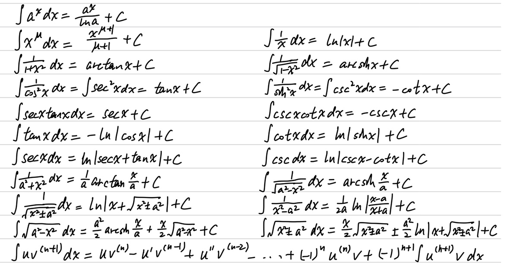
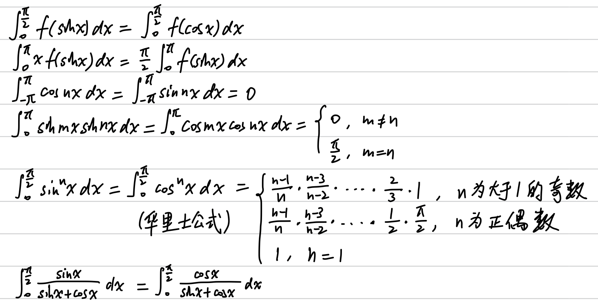
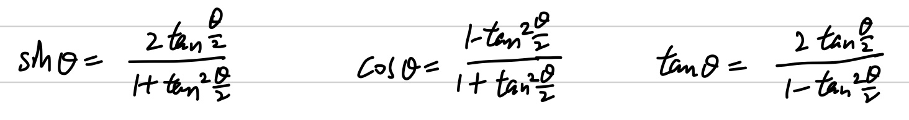

# 一元函数积分学

## 题型

### 🤔 求积分

1800：P107.3、P107.5、P107.6、P107.9、P107.10、P107.11、P107.12、P108.14、P108.16、P109.32、P109.33、P109.35、P109.37、P111.72、P111.73、P112.78、P112.79

- 不定积分要加任意常数 $C$
- 注意 $\int \frac{1}{x} \mathrm{d}x= \ln{|x|}$，需要观察自然定义域来决定是否可以去掉绝对值符号
- 被积函数中含有 $1+x$ 和 $e^x$，考虑凑出 $\rm{d}(xe^x)$
- 被积函数中含有 $1+e^x$，考虑分式上下同乘 $e^{-x}$
- 被积函数中含有 $\min$、$\max$ 函数，分段讨论
- 被积函数中同时出现 $\sin{x}\cos{x}$、$\sin^2{x}$、$\cos^2{x}$，考虑上下同除 $\cos^2{x}$，可得到关于 $\sec^2{x}$ 和 $\tan^2{x}$ 的式子
- 被积函数中含有极限式，有时需要分段讨论，并确保极限计算正确
- 注意积分区间中是否有无定义点，需分段按反常积分计算
- 使用换元法时，注意积分限要跟着变
- 被积函数分母为 $1+x^2$，且没有明显的凑微分方向时，尝试换元 $x=\frac{1-t}{1+t}$
- 被积函数中含有取整函数，取整数 $k \in (x-1, x]$，分别考虑 $k$ 左边和右边

### 🤔 判断积分或未知函数的符号

1800：P108.23、P109.28

- 利用奇偶性、周期性
- 拆分积分区间，分别换元，使得被积函数在相应区间内 $\ge 0$ 或 $\le 0$

## 注意

- 积分中值定理的中值点所在区间是闭区间，因为是通过介值定理推论证明的（介值定理推论也是闭区间）
- 如果被积函数连续，则可用变上限积分辅助函数+拉格朗日中值定理得到中值点在开区间
- 要证明积分的范围，在被积函数很难积的情况下，可尝试对被积函数的部分做放缩

## 公式定理

### 不定积分

### 不定积分（原函数）存在定理

- 若 $f(x)$ 连续，则 $F(x)$ 存在
- 若 $f(x)$ 有第一类间断点、无穷间断点，则在包含间断点的区间内 $F(x)$ 不存在
- 若 $f(x)$ 有震荡间断点，则 $F(x)$ 可能存在

### 定积分

### 三角函数万能公式

### 几个常见的反常积分

### $\Gamma$ 函数

