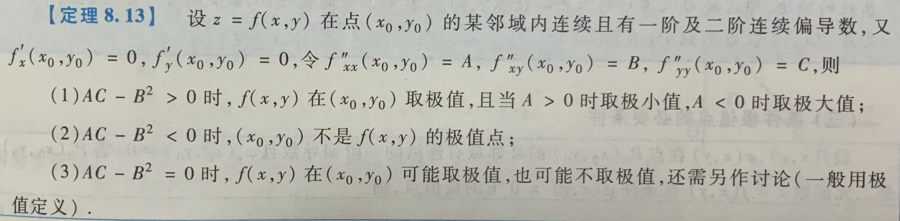

# 多元函数微分学

## 题型

### ✅ 抽象函数求偏导

1800：P37.7、P38.1、P114.1

- 关键在于看清楚自变量位置哪些与要求偏导的变量有关
- 🤔 通过 $f’_x(x,y)=0$ 可证明 $f(x,y)$ 仅为 $y$ 的函数（与 $x$ 无关）
    - 1800：P115.13

### ✅ 求某一点处的微分

- 对方程两边求全微分

### ✅ 根据偏导函数或全微分求原函数

- 对 $x$ 求积分，附带一项 $\varphi(y)$，再求导，得到 $\varphi’(y)$

### ✅ 求方向导数

1800：P114.5、P116.23

- 分别求偏导，再点乘**单位**方向向量
- 梯度方向的方向导数最大，$\frac{\partial f(x_0,y_0)}{\partial l} = \lvert \nabla f(x_0,y_0) \rvert$；逆梯度方向的方向导数最小，$\frac{\partial f(x_0,y_0)}{\partial l} = - \lvert \nabla f(x_0,y_0) \rvert$；与梯度垂直方向的方向导数为 0

### 🤔 求方程所确定隐函数的偏导

1800：P38.19、P115.9、P115.16

- 对方程（组）两边对某一参数求导
- 有时需要分别对 $x$ 和 $y$ 求导，得出方程组求解

### 🤔 判断连续性、可偏导性、可微性

1800：P39.17、P114.6、P114.7、P115.10、P115.11、P116.22

- 利用定义
    1. 先求极限，判断某点处连续性
    2. 若连续，用定义求某点处偏导数
    3. 若可偏导，写出 $\Delta f(x, y) = Adx + Bdy + g(x, y)$，判断 $g(x, y)$ 是否 $\rho \to 0$ 时的 $o(\rho)$（$\rho = \sqrt{x^2 + y^2}$），若是则可微
    4. 通常前 3 步足够，有时邻域内偏导数易求，可用偏导数连续来推出可微（充分条件）
- 利用连续、可偏导、可微之间的关系

### 🤔 给出形如 $f(tx, ty) = t^k f(x, y)$ 的题

1800：P114.2、P115.14

- 对 $t$ 求导，再令 $t = 1$

### 🤔 变量变换相关的题

1800：P116.18、P116.24

- 利用 $\frac{\partial g}{\partial u} = \frac{\partial g}{\partial x}\frac{\partial x}{\partial u} + \frac{\partial g}{\partial y}\frac{\partial y}{\partial u}$ 或 $\frac{\partial g}{\partial x} = \frac{\partial g}{\partial u}\frac{\partial u}{\partial x} + \frac{\partial g}{\partial v}\frac{\partial v}{\partial x}$ 可得到一个方程组，求解后再代入题中给出的等式即可

### 🤔 极值和最值问题

1800：P38.23、P114.8、P116.19

- 求出所有驻点和导数不存在的点（注意若边界方程是圆或椭圆，代入时应使用参数方程，避免遗漏两个导数不存在的点）
- 条件极值：直接带入条件、拉格朗日乘数法
- 利用极值充分条件判断是否是极值
- 根据题目含义可知唯一驻点必为所求极值点
- 直接比较各可能的极值点处函数值大小得到最大最小值

## 公式定理

### 二元函数极值充分条件

### 连续、可偏导、可微的关系

