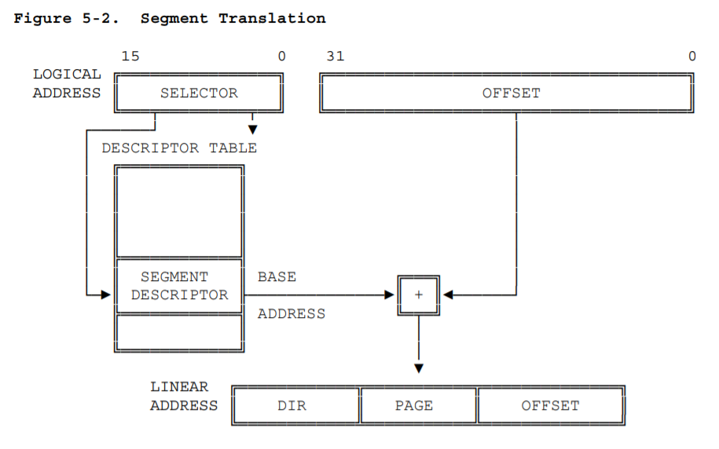

# Lab 1, Ex 3

分析 `boot/bootasm.S` 了解了 bootloader 从实模式切换到保护模式的过程。

## 初始设置

```s
cli               # Disable interrupts
cld               # String operations increment

# Set up the important data segment registers (DS, ES, SS).
xorw %ax, %ax     # Segment number zero
movw %ax, %ds     # -> Data Segment
movw %ax, %es     # -> Extra Segment
movw %ax, %ss     # -> Stack Segment
```

首先 `cli` 禁用中断，因为这时候还没有设置 IDT（中断描述符表），如果产生中断的话，CPU 将不能正确地找到相应的中断处理程序来处理。`cld` 是设置 x86 指令中字符串操作时的字符顺序，这里将其置零，即字符串操作时每个基本操作之后，将下标自增。

后面四行将 DS、ES、SS 初始化为 0。

## 使能 A20

```s
# Enable A20:
    #  For backwards compatibility with the earliest PCs, physical
    #  address line 20 is tied low, so that addresses higher than
    #  1MB wrap around to zero by default. This code undoes this.
seta20.1:
    inb $0x64, %al      # Wait for not busy(8042 input buffer empty).
    testb $0x2, %al
    jnz seta20.1

    movb $0xd1, %al     # 0xd1 -> port 0x64
    outb %al, $0x64     # 0xd1 means: write data to 8042's P2 port

seta20.2:
    inb $0x64, %al      # Wait for not busy(8042 input buffer empty).
    testb $0x2, %al
    jnz seta20.2

    movb $0xdf, %al     # 0xdf -> port 0x60
    outb %al, $0x60     # 0xdf = 11011111, means set P2's A20 bit(the 1 bit) to 1
```

根据实验指导书附录的「关于 A20 Gate」，在 8086 时代，由段+偏移机制所能产生的地址有 1088 KB，但地址线的物理寻址能力只有 1024 KB，当试图访问超过 1024 KB 的内存时，会发生「回卷」（wrap），而不会发生异常；但到了 80286，物理寻址能力已经提高，当访问超过 1 MB 的内存时不再发生回卷了，造成了不兼容，IBM PC 为了保持兼容性，加入了 A20 地址线的控制逻辑，并且大约是为了节省成本，这个控制逻辑被放在了键盘控制器中。A20 控制信号一开始是 0，表示屏蔽，也即保持兼容，在超过 1 MB 时「回卷」，为了利用完整的 32 位寻址能力，需要通过一系列 I/O 操作去改变键盘控制器中的相应控制信号。

`bootasm.S` 中的这部分代码有两阶段：第一阶段，向 8042 键盘控制器的 0x64 端口发送 0xD1 命令，表示要写 Output Port（因为 A20 控制信号在输出端口 P2 上）；第二阶段，向 0x60 端口（输入缓冲）发送要写入 Output Port 的内容，即 0xDF。

这里 0xDF 的二进制是 11011111，根据实验指导书和 OSDev Wiki 相关文档，其中第 1 bit 是 A20 使能信号，这里置为 1。但都没有提到其它位为什么这样设置。

于是在 `seta20.1` 之前加上了下面代码（`wait8042io` 是把等待 I/O 的那几行逻辑提取成了子程序）：

```s
call wait8042io
movb $0xd0, %al
outb %al, $0x64
call wait8042io
inb $0x60, %al
```

通过单步调试查看这段代码之后 AL 的值，发现是 11001111，又把这段代码移到 `seta20.2` 后面，确实变成了我们所期望的 11011111，但这里变动的并不是第 1 bit（无论从低到高数还是从高到低数）。TODO：限于时间原因，暂时无法深究原因。

## 初始化 GDT（全局描述符表）

在保护模式中，逻辑地址（段选择子 + 偏移地址）转换为线性地址需要用到 GDT。CPU 首先从段选择子中取出高 12 位的描述符表索引值，然后从 GDT 中获取相应索引对应的段描述符，其中包含了段基址，加上偏移地址也就是线性地址。示意图如下：



段描述符数据结构如下（对应了 `kern/mm/mmu.h` 中的 `struct segdesc` 结构体）：

！[Segment-Descriptor Format](images/segment-descriptor-format.png)

## 参考资料

- [Intel 80386 Programmer's Reference Manual](https://css.csail.mit.edu/6.858/2014/readings/i386.pdf), Chapter 5 Memory Management, Chapter 10 Initialization
- [实验指导书 2.5 关于 A20 Gate](https://objectkuan.gitbooks.io/ucore-docs/content/lab1/lab1_appendix_a20.html)
- ["8042" PS/2 Controller - OSDev Wiki](https://wiki.osdev.org/%228042%22_PS/2_Controller)
