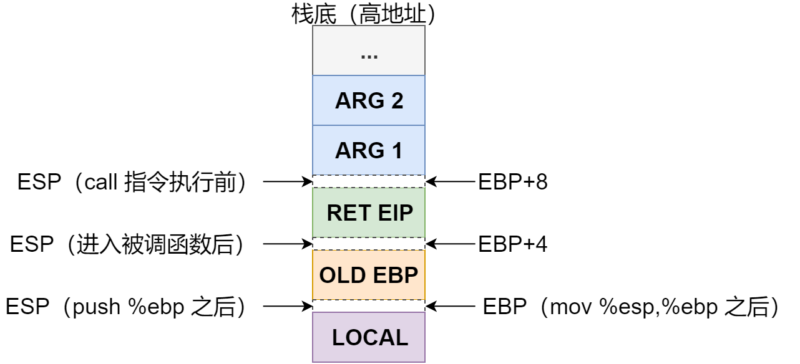
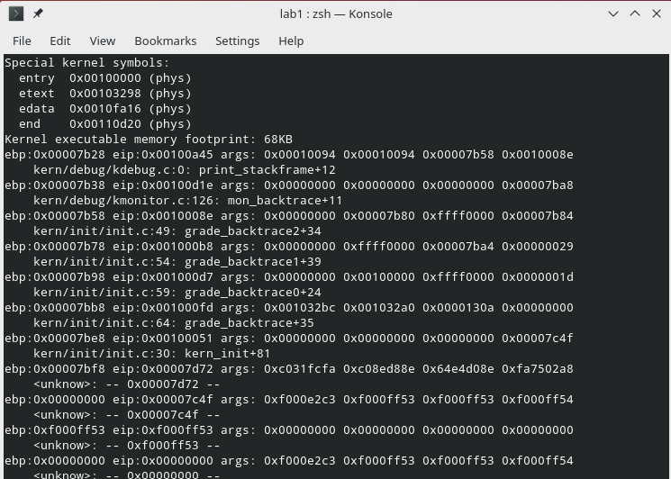

# Lab 1, Ex 5

## 理解函数堆栈

首先阅读实验指导书给出的函数调用堆栈相关的文档，了解到：当通过 `call` 指令进行函数调用时，通常先把参数按相应的顺序压栈（如 CDECL 约定从右往前压栈），然后执行 `call` 指令时，CPU 会在硬件层面将返回地址（`call` 指令的后一条指令的 EIP）入栈，然后跳转到被调用函数的入口，接着在被调用函数开头通常会将上一层的 EBP 压栈，然后将当前的 ESP（指向刚刚压栈的上一层 EBP）赋值给新的 EBP，于是通过这个 EBP 就可以向高地址处访问返回地址和参数以及向低地址处访问局部变量。重新画了示意图如下：



上面所说的「将上一层的 EBP 压栈，然后将当前的 ESP 赋值给新的 EBP」汇编代码如下（可以在 `obj/kernel.asm` 里面得到验证）：

```s
push   %ebp
mov    %esp, %ebp
```

## 编写 `print_stackframe()` 函数

明白原理之后，`print_stackframe()` 函数要做的其实就是打印当前 EBP 和 EIP 及参数，然后通过 EBP 和 EBP + 4 分别获取上一层的 EBP 和函数返回地址，以此类推不断重复。

参考注释实现了如下代码：

```c
void
print_stackframe(void) {
     /* LAB1 YOUR CODE : STEP 1 */
     /* (1) call read_ebp() to get the value of ebp. the type is (uint32_t);
      * (2) call read_eip() to get the value of eip. the type is (uint32_t);
      * (3) from 0 .. STACKFRAME_DEPTH
      *    (3.1) printf value of ebp, eip
      *    (3.2) (uint32_t)calling arguments [0..4] = the contents in address (uint32_t)ebp +2 [0..4]
      *    (3.3) cprintf("\n");
      *    (3.4) call print_debuginfo(eip-1) to print the C calling function name and line number, etc.
      *    (3.5) popup a calling stackframe
      *           NOTICE: the calling funciton's return addr eip  = ss:[ebp+4]
      *                   the calling funciton's ebp = ss:[ebp]
      */

     uint32_t eip = read_eip();
     uint32_t ebp = read_ebp();
     for (int i = 0; i < STACKFRAME_DEPTH; i++) {
         uint32_t *args = (uint32_t *)(ebp + 8);
         cprintf("ebp:0x%08x eip:0x%08x args: 0x%08x 0x%08x 0x%08x 0x%08x\n",
                 ebp, eip, args[0], args[1], args[2], args[3]);
         print_debuginfo(eip);
         eip = *(uint32_t *)(ebp + 4);
         ebp = *(uint32_t *)(ebp);
     }
}
```

运行 `make qemu` 可以看到确实打印了如实验要求的函数调用栈信息：



## 优化实现

观察到输出的后面很多条都是无效的（EBP 是 0，函数名 unknown），显然是因为上面的实现循环了 `STACKFRAME_DEPTH`（20）次，而实际调用深度并没有这么深。

为了实现只打印到函数调用的最开始，修改实现如下：

```c
uint32_t eip = read_eip();
uint32_t ebp = read_ebp();
for (int i = 0; i < STACKFRAME_DEPTH; i++) {
    uint32_t *args = (uint32_t *)(ebp + 8);
    cprintf("ebp:0x%08x eip:0x%08x args: 0x%08x 0x%08x 0x%08x 0x%08x\n",
            ebp, eip, args[0], args[1], args[2], args[3]);
    print_debuginfo(eip);
    eip = *(uint32_t *)(ebp + 4);
    ebp = *(uint32_t *)(ebp);

    if (ebp == 0) break;
}
```

也就是添加了 `if (ebp == 0) break;` 判断是否已经到了调用栈的最顶部（因为系统刚启动时 EBP 为 0，之后调用都会通过 `mov %esp, %ebp` 修改）。

重新运行发现确实有效，只打印到了第一个 unknown 函数便停止。

## 参考资料

- [实验指导书 2.3.3.1 函数堆栈](https://objectkuan.gitbooks.io/ucore-docs/content/lab1/lab1_3_3_1_function_stack.html)
