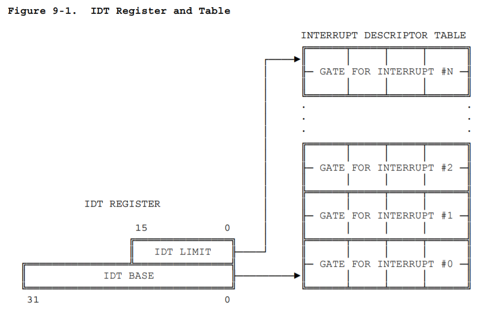
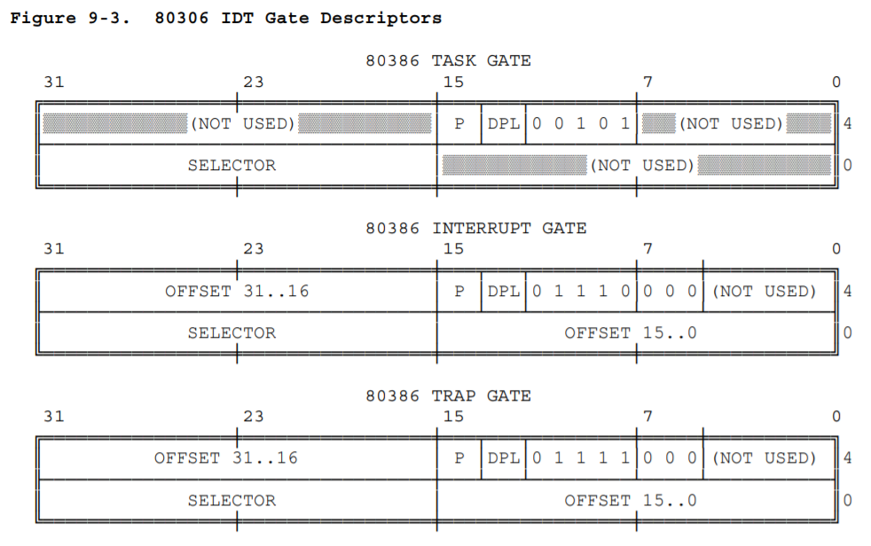
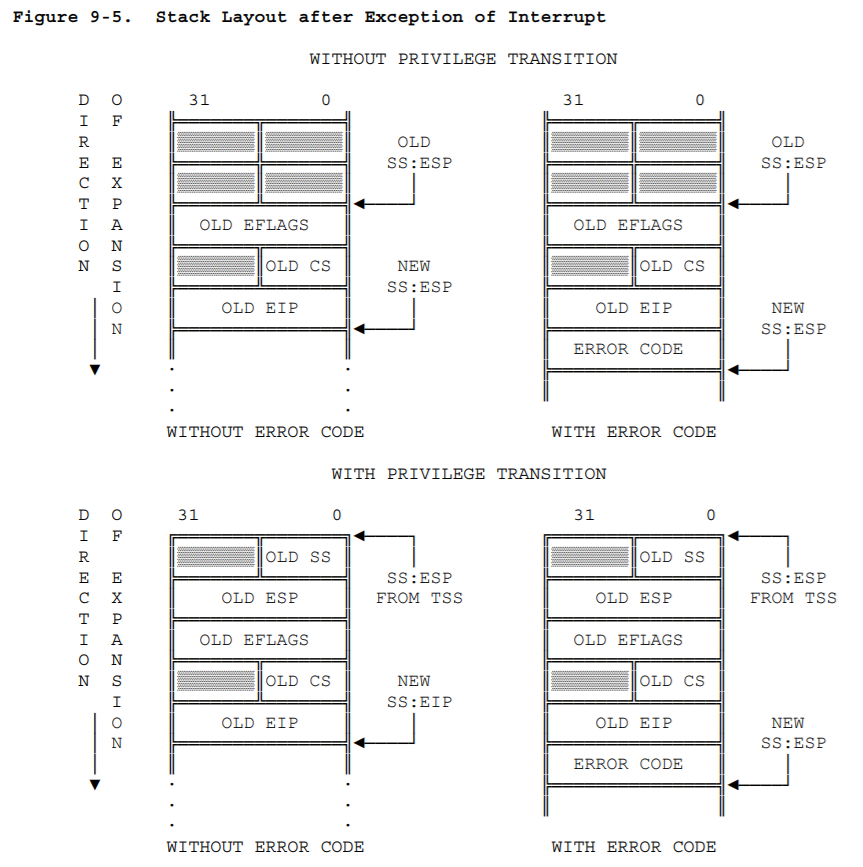
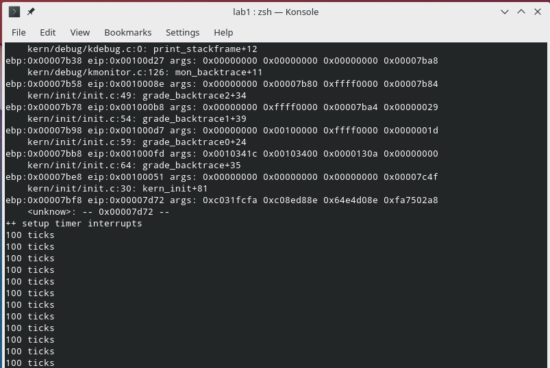

# Lab 1, Ex 6

## 理解 IDT（中断描述符表）

通过阅读实验指导书相关章节，以及 80386 的参考手册中相关部分，了解到：

当 CPU 收到外部中断（interrupt），或检测到异常（exception）时，会在 IDT 中以中断向量作为索引取到对应的中段描述符。其中，IDT 在内存中的位置由 IDTR 寄存器给出（包括线性的基址和界限）：



中断描述符有三种类型：任务门（task gate）、中断门（interrupt gate）、陷阱门（trap gate）。结构分别如下：



本实验中只用到中断门和陷阱门。

从示意图可以看出，每个中断描述符占 8 个字节，其中低 16 位和高 16 位是中断服务程序的段内偏移，第 [31:16] 位是中断服务程序所在段的段选择子。CPU 通过这个段选择子在 GDT 中找到相应的段描述符，然后得到段基址，再加上段内偏移，就得到了中断服务程序入口所在的线性地址。

## 理解中断服务程序的调用过程

CPU 在获取到中断服务程序入口地址后，首先根据 CPL 和段描述符中的 DPT 判断是否发生了特权级转换，如果发生了特权级转换（从 ring 3 转到 ring 0），则从当前程序的 TSS 信息中拿到内核栈地址，也即内核的 SS 和 ESP 值，然后将当前使用的栈切换到内核栈，紧接着将刚才用户态的 SS 和 ESP 压入内核栈，以便中断处理结束后恢复到用户栈。

接着，将 EFLAGS、CS、EIP、ERROR CODE（如果有）依次压栈，以保护进入中断服务程序前的现场。然后将中断服务程序的入口地址加载到 CS 和 EIP，正式开始执行。

上述过程导致的栈结构如下：



中断服务程序返回时（`iret` 指令执行时），CPU 逆转上述过程，将 EIP、CS、EFLAGS 一次弹出（注意 ERROR CODE 需要中断服务程序自己弹出），如果发生了特权级转换，还需要弹出 SS 和 ESP，恢复到原来的栈。

## 理解特权级的转换

整个中断处理流程中有三个不同的特权级：CPL、中断描述符 DPL、目标代码段（中断服务程序所在段）DPL。这里有两个限制：

第一，CPL 必须大于等于目标代码段 DPL，也就是说，只能从较低特权级触发中断转到较高特权级，或者从内核态触发中断并仍然在内核态；

第二，对于软中断（系统调用），CPL 必须小于等于中断描述符 DPL，也就是说，触发中断所在的特权级必须高于中断描述符所要求的特权级，以防止用户态程序随意触发中断。

以上两个限制检查检查失败，会产生一个一般保护异常（general protection exception）。

## 编写 `idt_init()` 函数初始化 IDT

根据实验指导书和代码注释的提示，`idt_init()` 函数中需要首先获得 `kern/trap/vectors.S` 中的各中断服务程序入口地址，然后使用 `SETGATE` 宏依次设置全局数组 `struct gatedesc idt[256]` 的每个项（也就是 IDT 中的 256 个中断描述符），最后使用 `lidt` 指令通知 CPU 设置 IDT 所在线性地址到 IDTR。

这里主要有几个点。首先，`kern/trap/vectors.S` 文件是在 make 时由 `tools/vector.c` 生成的，里面包含代码段和数据段，代码段有 256 个中断服务程序，分别是 `vector0` 到 `vector255`，数据段有一个数组 `__vectors`，里面包含了所有中断服务程序的地址。要读取这个 `__vectors` 数组，需要在 `kern/trap/trap.c` 中通过 `extern uintptr_t __vectors[]` 声明。

第二，`kern/trap/vectors.S` 中的内容，经过汇编和链接后，进入了 `bin/kernel` 内核程序中，因此这里的 `vector0` 到 `vector255` 显然是在内核代码段中的，`__vectors` 中所保存的中断服务程序入口地址也就是其在内核代码段中的偏移。因此使用 `SET_GATE` 宏时，`sel` 和 `off` 参数分别传入内核代码段选择子和 `__vectors` 中的段内偏移。

第三，根据实验代码中已经给出的 `trapname(trapno)` 函数中的内容，发现中断号大于等于 `IRQ_OFFSET` 小于 `IRQ_OFFSET + 16` 的这一段属于硬件中断，那么也就不属于异常，因此在 `SET_GATE` 宏调用中，对于这一段中断号，需要对 `istrap` 参数传入 0，而其它的传入 1。

第四，对于系统调用，需要设置中断描述符的 DPL 为 3，从而使用户态程序能够触发系统调用中断，转到内核态。

最终代码如下：

```c
void
idt_init(void) {
    extern uintptr_t __vectors[];
    int istrap;
    for (int trapno = 0; trapno < 256; trapno++) {
        if (trapno >= IRQ_OFFSET && trapno < IRQ_OFFSET + 16) {
            istrap = 0;
        } else {
            istrap = 1;
        }
        SETGATE(idt[trapno], istrap, KERNEL_CS, __vectors[trapno], trapno == T_SYSCALL ? 3 : 0);
    }
    lidt(&idt_pd);
}
```

## 编写时钟中断处理逻辑

各个中断的处理逻辑都在 `trap_dispatch(tf)` 函数中，于是分析了中断如何到达这个函数。

首先，由于刚刚设置了 IDT，CPU 产生中断之后能够正确找到 `kern/trap/vectors.S` 中的中断服务程序。观察其中一个如下：

```s
.globl __alltraps
.globl vector0
vector0:
  pushl $0
  pushl $0
  jmp __alltraps
```

可以发现这 256 个中断服务程序所做的事情就是把中断号压栈，然后直接跳转到 `__alltraps` 子程序。

再找到 `kern/trap/trapentry.S` 中的 `__alltraps` 子程序，发现它主要做了这些事情：

1. 将各寄存器压栈
2. 设置内核数据段
3. 将 ESP 作为参数压栈
4. 调用 `trap(tf)` 函数
5. 恢复现场（将各个参数、寄存器弹出）
6. 通过 `iret` 指令退出中断服务程序

这里最巧妙之处在于将 ESP 作为参数压栈，它实际上是当前栈顶地址，从它开始向高地址可以访问到刚刚压栈的各寄存器和`kern/trap/vectors.S` 中压栈的中断号以及 CPU 自动压栈的 EIP、CS、EFLAGS 等数据。通过 `kern/trap/trap.h` 中的 `struct trapframe` 结构体，将 ESP 作为该结构体指针，可以在 C 语言中非常方便的访问这些数据。

再来看 `trap(tf)` 函数，直接调用了 `trap_dispatch(tf)`，也就是我们需要编写时钟中断处理逻辑的函数。

理清楚整个过程后，这个功能实现起来就非常简单了：

```c
switch (tf->tf_trapno) {
    case IRQ_OFFSET + IRQ_TIMER:
        ticks++;
        if (ticks % TICK_NUM == 0) {
            print_ticks();
        }
        break;
    // ...
}
```

## 运行验证效果

运行 `make qemu` 可以看到 IDT 设置确实生效，并且时钟中断正确的被处理了。效果如下：



## 参考资料

- [实验指导书 2.3.3.2 中断与异常](https://objectkuan.gitbooks.io/ucore-docs/content/lab1/lab1_3_3_2_interrupt_exception.html)
- [Intel 80386 Programmer's Reference Manual](https://css.csail.mit.edu/6.858/2014/readings/i386.pdf), Chapter 9 Exceptions and Interrupts
