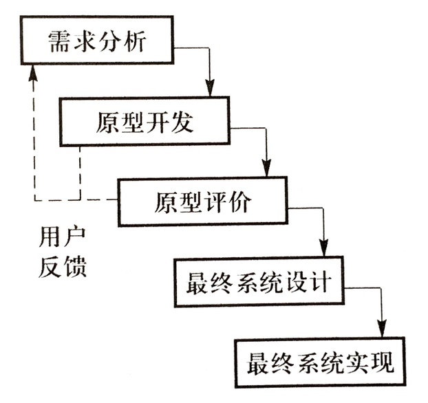
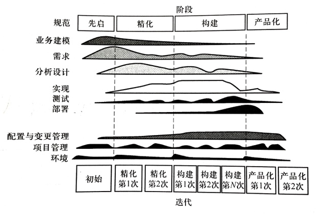

# 软件过程

软件过程是指软件生存周期中的一系列相关过程。其中，过程是活动的集合，活动时任务的集合，任务要起到把输入加工成输出的作用。活动的执行可以是顺序的、迭代的、并行的、嵌套的，或是有条件引发的。

## 软件生命周期模型

### 瀑布模型

又称线性顺序模型。

需求分析、设计、实现、测试、交付、使用和维护依次顺序执行。每个阶段结束处设有评审，通过评审才能进入下一阶段。

缺点是太过理想化，不能适应快速变化的现实环境。

以下情况下**不适合**使用瀑布模型：

- 需求未被充分理解
- 系统太大而不能一次开发完成
- 实现打算采用的技术迅速发生变化
- 需求迅速发生变化
- 资源有限，如工作人员/资金不足
- 无法利用中间产品

### 增量模型

又称有计划的产品改进模型。从一组给定的需求开始，通过构造一系列可执行版本来实施开发活动。第一个版本纳入部分需求，下一个版本纳入更多需求，以此类推。分析和架构设计只需要进行一次，而软件详细设计、编码、测试、集成、验收在每个版本中都需要进行。

相比瀑布模型的特点：

- 多个版本可以并行开发
- 每个版本都是可运行的产品
- 需求在开发早期是明确的

以下情况下**不适合**使用增量模型：

- 需求未被很好的理解
- 突然提出一些功能
- 实现打算采用的技术迅速发生变化
- 需求迅速发生变化
- 在较长时间内没有充足资源保证

以下情况下**适合**使用增量模型：

- 需要早期获得功能
- 中间产品可以使用
- 系统被自然地分为增量
- 工作人员/资金可逐步增加

### 演化模型

只要核心需求能够被很好理解，就可以进行渐进式开发，其余需求在后续迭代中逐渐定义和实现，这种过程模型称为演化模型。

特点：

- 渐进地开发各可执行版本，逐步完善
- 支持并行开发，增量式交付产品
- 通过迭代缓解技术风险和系统集成风险
- 只需要理解核心需求即可开始开发
- 允许需求变更

演化模型是目前最广泛使用的模型，包括统一软件过程（RUP）、许多敏捷过程（XP、Scrum 等）。

演化模型的缺点是复杂，比较难规划和控制迭代，这也是其成功的关键。

#### 迭代化开发原则

迭代的安排和计划是由风险驱动的。

#### 原型模型

对原型有两种处理方式：

- 抛弃式原型
- 演化式原型：原型作为最终产品的一部分，经用户试用反馈后不断演进，最终成为完整产品。通常需要经过多个迭代

原型模型可能存在的问题：

- 不切实际的进度和费用预算：用户可能会以为开发完整产品也和开发原型一样简单快速
- 建立原型耗时太长
- 设计欠佳：设计不能适应用户的需求变更

#### 螺旋模型

螺旋模型将原型的迭代特征与瀑布模型中控制和系统化的方面结合起来，并增加了风险分析，使软件的快速迭代开发成为可能。

## 统一软件过程 RUP

是一个风险驱动的、基于 UML 和构建式架构的迭代、演化开发过程。

把软件开发生命周期分为四个阶段：

- 先启（Inception）：所有项目干系人之间就项目目标达成共识
- 精化（Elaboration）建立软件架构基线，解决技术风险，为软件的详细设计和实现提供稳定基础。精化的结束是架构里程碑
- 构建（Construction）：基于已建立基线的架构完成开发。构建的结束是软件初始能力里程碑
- 产品化（Transition）：确保最终用户可以使用软件。产品化的结束是软件产品发布里程碑

每个阶段都可以细分为若干迭代，每个迭代的结束标志是一个技术里程碑（小里程碑）。

## 敏捷过程

强调以人为本，快速响应需求和变化，把注意力集中到项目主要目标——可用软件上，在保证质量的情况下，做到文档适度。

基于适应而非预测，弱化了针对未来需求的设计而注重当前系统的简化，依赖重构来适应需求的变化，通过快速、短迭代的开发，不断产出和演化可运行软件。

适合采用敏捷过程的情况：

- 需求不确定
- 有责任感和积极向上的开发人员
- 用户容易沟通并能参与
- 小于 10 个人的项目团队

### XP

价值目标：沟通、简化、反馈、勇气。

XP 生命周期中的四个基本活动：编码、测试、聆听、设计。

状态变迁图：

计划/反馈循环：

XP 的特点是，首先开发最重要的特性，迅速向客户提供所需功能，随着代码的演进通过重构来满足新的需求，从而将整个项目失败的风险减到最小。从需求定义开始，省略了常规的系统和架构设计步骤，直接进入编码迭代，编码和设计同时进行，并且特别强调测试的重要性。

XP 弱化了针对未来需求的设计，而是注重当前的简化。

### Scrum

XP 关注的是敏捷软件开发技术，而 Scrum 关注的是敏捷软件开发管理。

Scrum 方法将传统开发中的分析、设计、实现视为一个黑箱，认为应加强黑箱内部的混沌性，使项目组工作在混沌的边缘，充分发挥人的创造性。

核心准则是自我管理和迭代开发。

#### 自我管理

Scrum 团队自组织、跨职能，以迭代的方式工作。每个 Scrum 团队有三个角色：

- Scrum 主管（相当于项目经理）：负责确保成员都能理解并遵循过程，通过指引让 Scrum 团队更高效地工作
- 产品负责人（Product Owner）：定义和维护产品需求，负责最大化 Scrum 团队的工作价值
- 团队：负责具体工作，理想规模是 5～9 个人

Scrum 过程中没有中心控制者，强调发挥个人的创造力和能动性，鼓励团队成员进行自我管理，使用自己认为最好的方法和工具进行开发。

#### 迭代开发

Scrum 是一种演进型的迭代开发过程，核心是 Sprint，即贯穿于开发工作着保持不变的一个月（或更短时间的）迭代。每个 Sprint 都会提交一个经测试可发布的软件产品增量版本。
