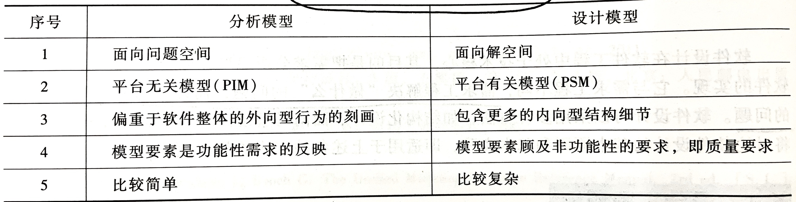
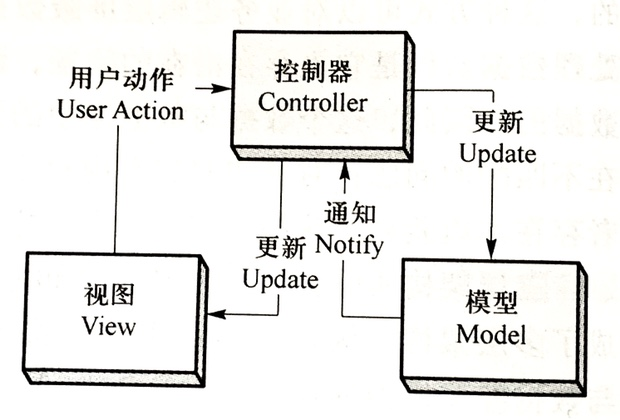
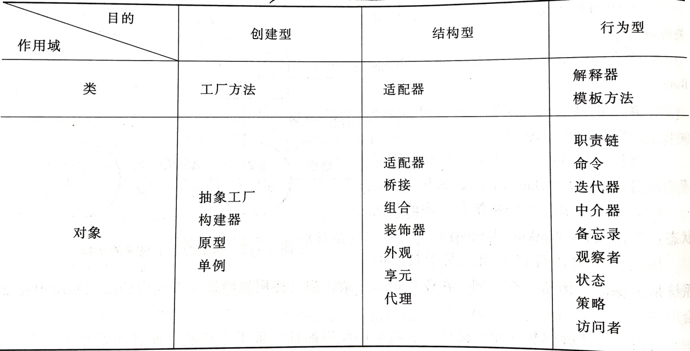
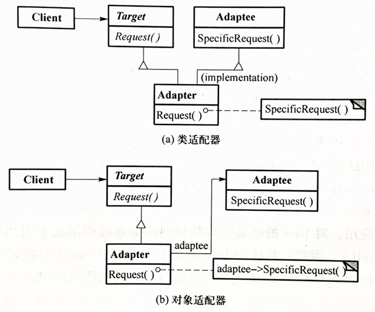
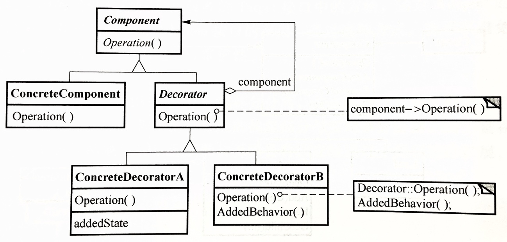
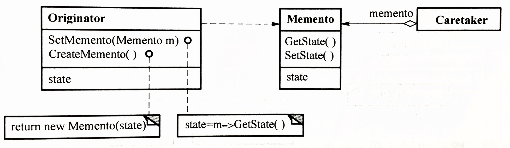

# 设计工程

## 设计工程概述

软件设计过程：

- 架构设计：又称概要设计，它定义了软件的全貌，记录了最重要的设计决策，并成为随后的设计与实现工作的战略指导原则
- 详细设计：又称构件级设计，它在软件架构的基础上定义各模块的内部细节，例如内部数据结构、算法、控制流等，其所做的设计决策常常只影响单个模块的实现

分析模型与设计模型的区别：



## 软件设计原则

- 抽象
- 分解和模块化
- 封装和信息隐藏
- 高内聚和低耦合：内聚显示了单个模块内部功能的相关性，耦合显示了模块间的相互依赖性

## 软件质量属性

- 可用性/可靠性
- 可修改性/可维护性
- 性能
- 安全性
- 可测试性
- 易用性

## 架构风格

常见的架构风格：


### 通用结构的架构风格

#### 分层架构（layered）

特点：

- 每一层向高层暴露接口以提供服务，并对高层屏蔽低层
- 每一层都提供了与其他层有明确区分的功能，高层就像是依赖于低层运行的虚拟机，而低层不依赖于高层

优点：

- 良好的可修改性：可以在不影响高层程序的情况下替换低层设施，例如 Java 程序一次编译即可运行在 Linux 和 Windows，只需替换 Java 虚拟机
- 良好的复用性：通过良好设计的标准接口，某一层可以被多个高层复用，例如 JDBC 驱动通过标准的接口屏蔽了底层数据库连接的细节，可在许多系统中复用

缺点：

- 有损性能：层数越多，一层一层调用接口的开销就会越大，对性能影响越大
- 用户代码的控制力会被削弱：高层只能使用下一层提供的接口，而无法利用更低层的接口
- 分层质量受抽象的影响：如果对系统的抽象不合理，则分层质量也不会很好，例如 MVC 架构中如果将大量业务逻辑放到 View 层，则破坏了分层结构的特点

#### 管道与过滤器架构

例如 Linux shell：`cat access.log | grep somepage`。

#### 黑板架构

黑板架构为用于解决问题的知识源提供了共享的数据表示方法，这些数据表示方法是与应用相关的。

包括以下部分：

- 知识源：彼此独立、与应用相关的知识包，之间通过黑板实现交互，而不直接交互
- 黑板数据结构：问题解决过程中的状态数据，知识源会更新黑板数据，从而增量式解决问题
- 控制流：完全由黑板状态驱动，知识源会在黑板状态更新时根据其状态作出相应的响应

例如 Vuex 的 store。

### 分布式系统的架构风格

#### 客户端/服务器架构（C/S 架构）

优点：

- 有效降低服务器端的负荷
- 能够提供复杂的用户界面
- 能够传输和缓存大量的数据

缺点：

- 软件升级代价大
- 服务器端的控制减弱

#### 三层架构（3-tier）

在客户端和服务器端的数据库之间加入一个中间层，有关业务逻辑的实现都放在这一层中，客户端只负责用户界面的呈现，它通过中间层与数据库交互。

三层分别是：

- 表示层
- 业务逻辑层
- 数据访问层

这里的三层架构和前面的分层架构不太一样，前面的分层架构强调软件的模块组织上，高层调用低层提供的接口，以实现抽象和复用，而这里的三层强调软件的不同功能部分在物理上分布式地运行在三个地方（用户终端、应用服务器、数据库服务器）或三个进程中。

可划分更多层次，以进一步解耦，形成 n-tier 架构。

优点：

- 有利于开发人员分工
- 有利于系统维护和复用

缺点：

- 有些修改会贯穿所有层
- 数据访问层潜在的问题：业务逻辑层的 ORM 对象和数据库中的实际数据之前的一致性问题

#### 代理架构

例如通过反向代理和 URL 映射等技术向用户屏蔽后端实际的服务器地址，使表现出来的各子网站像是一个整体。

### 交互式系统的架构风格

#### MVC 架构



#### 表示-抽象-控制架构（PAC 架构）

### 自适应系统的架构风格

#### 微内核架构

#### 反射架构

### 其他架构风格

- 批处理架构
- 解释器架构
- 进程控制架构
- 基于规则的架构

## 设计模式

GoF 设计模式分类：



### 创建型设计模式

#### 工厂方法 Factory Method


抽象工厂类（例如 `UserFactory`）提供一个接口（例如 `createUser`），用于创建一个抽象的产品对象（例如 `User`），在其子类具体工厂（例如 `GoldUserFactory`）中实现该方法，创建具体的产品对象（例如 `GoldUser`）并返回（这里适用 Liskov 替换原则，方法的返回类型是 `User`，实际是一个 `GoldUser`）。

解决的问题是，当需要新增一种具体产品类型时，只需添加一个新的具体工厂，而无需修改现有的对旧工厂的使用。

#### 抽象工厂 Abstract Factory


上面的工厂方法模式强调抽象的工厂类的接口由具体的工厂子类实现，创建具体的产品类对象并作为抽象的产品类返回。

而抽象工厂模式强调一个工厂可以生产一系列相关联的产品，例如上图的 `createMouse`、`createKeyboard`，每一个具体的工厂有自己的生产这一系列具体产品的逻辑。

解决的问题是，当需要新增一系列的新具体产品类时，例如上图中如果需要加入生产华硕产品的具体工厂，则只需要添加新的工厂类 `AsusFactory`，并实现所有工厂方法接口，而无需修改现有的对旧工厂的使用。

#### 构建器 Builder

例如：

```java
AlertDialog dialog = AlertDialog.getBuilder().
    .setTitle("Alert Title")
    .setContent("This is an alert!")
    .setDuration(10)
    .build();
```

用于将一个复杂对象的构造逻辑封装在单独的 Builder 类中，以便于接口调用者使用。

#### 原型 Prototype

使用一个已有的对象作为原型，创建一个完全相同的新对象，以供之后修改使用。

例如：

```java
Dict newdict = dict.copy();
```

#### 单例 Singleton

用于使整个应用共用同一个全局对象，而不是每次使用时分别创建。

例如：

```java
Calendar calendar = Calendar.getInstance();
```

### 结构型设计模式

#### 适配器 Adapter



用于将一个类的接口转换为客户希望的接口，使不兼容的接口可以协作。

例如图中 `Target` 和 `Adaptee` 可能是功能相同但接口不同的类，`Adapter` 类通过实现 `Target` 的接口并在内部实际调用 `Adaptee` 的接口，来进行适配。

#### 桥接 Bridge


对于有两个变化纬度的系统，例如 `User` 抽象类可能有 `GoldUser`、`SilverUser` 两个子类，而它们内部又可以使用 `Contact` 抽象类的 `Telephone`、`Email` 两个子类作为 `contact` 字段，这时如果将 `contact` 的类型写死在 `User` 的子类中，则需要写四个具体 `User` 类。

桥接模式通过将 `Contact` 对象在运行时通过构造函数传入 `User` 对象，将这两个维度的变化解耦。当调用 `user.contactUser()` 时，内部将调用具体 `Contact` 类的实现函数。

#### 组合 Composite


将对象组织成树状结构，以表示“部分与整体”的层次结构，使用户可以以统一的方式处理单个对象和对象组合。

例如 GUI 系统里的 View 树。

#### 装饰器 Decorator



用于在不子类化的情况下，扩展一个现有类的行为。

如图，`Decorator` 类实现和 `ConcreteComponent` 相同的接口，并持有一个 `ConcreteComponent` 的字段。作为所有装饰器类的公共基类，`Decorator` 的接口实现仅仅调用 `component` 的对应方法，而它的具体子类可以重载所需的方法，以在某些行为前后加上附加行为。

Python 的装饰器也是装饰器模式的例子。

#### 外观 Facade

用于将子系统的一组接口包装为更高层的统一接口，使子系统更容易使用。

例如，相比系统调用 `read`、`write`，`fprintf` 和 `fscanf` 提供了更简单易用的字符串读写接口。

#### 享元 Flyweight

用于通过共享有效地支持数量庞大的细粒度对象。

例如线程池。

#### 代理 Proxy

用于通过代理对象控制对被代理对象的访问，使用场景包括提供对远程对象的本地表示、用于随需创建开销高昂的对象（懒加载）、对被代理对象进行保护、以及执行额外的行为等。

例如 JavaScript 的 Proxy 对象。

### 行为型设计模式

#### 职责链


#### 命令

将操作或请求封装成对象，从而可实现将请求排队、记录日志、支持撤销操作等。

#### 解释器

在运行时将简单的查询或配置语言解析成语法树来处理。

#### 迭代器

实现无需暴露聚合对象底层表示就可以按顺序访问其各个元素的方式。可以为不同聚合对象提供统一的访问接口。

例如 C++ 的迭代器。

#### 中介器

#### 备忘录



无需破坏封装，就可以捕获对象的内部状态，并将其保存在对象外部，使得该对象将来可以恢复到此状态。也就是对象提供接口允许外界对其拍快照，外界用户不需要知道快照内部的结构，也可以在随后恢复。

#### 观察者

例如 Java 中常用的 pub/sub 模式。

#### 状态

允许一个对象在其内部状态发生变化时改变其行为。即状态机。

#### 策略

允许将某种相同功能的不同算法在运行时传入，以改变某个通用函数或方法的行为。

例如 C++ 的 `sort` 函数可以传入函数作为比较器。

#### 模板方法


允许在父类中定义算法框架，而算法各步骤的细节可在子类中定制。

#### 访问者

允许在不改变对象结构中的各个元素的情况下，定义作用于这些元素的不同操作。

例如对容器类实现 `traverse` 方法时通常允许传入参数 `vistor`。
