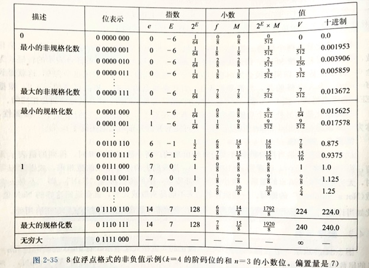
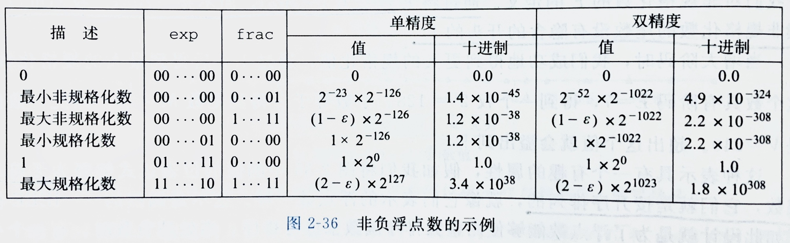

# 第2章 信息的处理和表示

## C 语言数据类型大小

`long` 和指针类型在 32 位和 64 位上分别是 4 字节和 8 字节，其它数据类型在两个平台上相同。

## 字节序

对于 0x100 地址处的十六进制数 0x01234567，大端存储：

| 内存地址 | ... | 0x100 | 0x101 | 0x102 | 0x103 | ... |
| --- | --- | --- | --- | --- | --- | --- |
| 值 |  | 01 | 23 | 45 | 67 |  |

小端存储：

| 内存地址 | ... | 0x100 | 0x101 | 0x102 | 0x103 | ... |
| --- | --- | --- | --- | --- | --- | --- |
| 值 |  | 67 | 45 | 23 | 01 |  |

注意内存地址的顺序，并且整个数据的地址始终是各字节地址最小者。

## 位运算

异或运算的性质：`a ^ a = 0`、`a ^ a ^ b = b`、`x ^ y == (x & ~y) | (~x & y)`。

左移：右端补 0；逻辑右移：左端补 0；算数右移：左端补最高有效位。

## 整数

C 语言标准中，除了固定大小的数据类型（如 `int32_t`）之外，只要求正负数对称的取值范围，比如 `char` 只要求 -127 到 127，但在实现中几乎全都是 -128 到 127（补码表示）。

补码定义：对位向量 $x = [x_{w-1}, x_{w-2}, \cdots, x_0]$，$B2T_w(x) = - x_{w-1} \cdot 2^{w-1} + \sum\limits_{i=0}^{w-2} x_i \cdot 2^i$。

整数的强制类型转换保持位模式不变，数值可能会改变。

补码转无符号：$T2U_w(x) = \begin{cases} x + 2^w, & x < 0 \\ x, & x \ge 0 \end{cases} = x + x_{w-1} \cdot 2^w$。

无符号转补码：$U2T_w(u) = \begin{cases} u, & u \le TMax_w \\ u - 2^w, & u > TMax_w \end{cases} = - u_{w-1} \cdot 2^w + u$。

当执行一个运算时，如果一个运算数是有符号的而另一个是无符号的，C 语言会隐式地将有符号数强制类型转换为无符号数，并假设两个数都是非负的，来执行这个运算。

扩展数字的位表示：无符号数——零扩展，补码——符号扩展。

截断数字：总是舍弃位模式中的高位，保留低位，然后再转回无符号数或补码。

求补码加法逆元的方法：按位取反再加一。

补码加法运算形成阿贝尔群，可交换可结合，故 `x + y - x == y`、`x + y - y == x`。

无符号数乘法和补码乘法在位级别等价。

整数除法总是舍入到零，也就是说，向下舍入正数，向上舍入负数。

对于无符号数，使用逻辑右移操作可以直接算出除以 2 的幂（向零舍入）。

对于补码，使用算数右移操作可产生 $\lfloor x/2^k \rfloor$，对于非负数来说这个值是正确的，对于负数来说舍入方向错误。可通过对负数加上“偏置”来修正舍入方向，具体地，`(x + (1 << k) - 1) >> k` 可以产生 $\lceil x/2^k \rceil$，原理是 $\lceil x/y \rceil = \lfloor (x+y-1)/y \rfloor$。综合起来，`(x < 0 ? x+(1<<k)-1 : x) >> k` 可对补码产生正确的 $x/2^k$。

## 浮点数

使用 IEEE 754 标准。

精度 | 符号位 | 阶码位 | 尾数位
--- | --- | --- | ---
单精度 | 1 | 8 | 23
双精度 | 1 | 11 | 52

以单精度为例，有 4 种数值分类：

其中包含三种情况：

- 规格化的值：最普遍的情况。e 的位模式不全为 0，也不全为 1（对于单精度，exp 范围在 1～254），阶码值 $E=e-Bias$，Bias 是 $2^{k-1} - 1$（单精度 127，双精度 1023）的偏置。因此指数范围为单精度 -126～+127、双精度 -1022～+1023；f 表示带隐含 1 的尾数，即尾数值 $M=1+f$。
- 非规格化的值：e 的位模式全为 0，阶码值 $E=1-Bias$，尾数值 $M=f$（不包含隐含 1）。
- 特殊值：e 的位模式全为 1，当小数域全为 0 时，表示无穷，小数域不为 0 时，表示 NaN。

浮点数在数轴上分布的示例：

一些取值的示例：

可以发现，非规格化数，由于阶码是固定的，也就是说指数是固定的 $E=1-Bias$，从而小数部分的变化相当于线性的增减 $2^E$，所以非规格化数在数轴上是均匀等距分布的；而对于规格化数，每个指数的取值下，小数的可能的取值数是一样的，而指数变化表现为数量级的变化，因此指数值越大，浮点数在数轴上分布越分散。

非规格化数的阶码部分解释为 $E=1-Bias$ 可使得非规格化数能够平滑过渡到规格化数（最大的非规格化数的位模式加 1 得到最小的规格化数），这个巧妙之处在于，最大的非规格化数的尾数部分加 1 溢出，变为 0，而阶码部分也加 1，但偏置算法变了，于是阶码表示的指数值没有变，而尾数部分多了隐含 1，于是整个数平滑变化了。

单精度和双精度的一些边界值：

四种舍入方式：

- 向偶数舍入（默认方式）：试图向最接近的值舍入，如果数值在中间（距离两边相等），则向上或向下舍入使得结果的最低有效位是偶数。注意，这不同于“四舍五入”。
- 向零舍入：正数向下舍入，负数向上舍入
- 向下舍入
- 向上舍入

向偶数舍入的好处：如果使用向上或向下舍入，则在计算一组数的平均值时，将会偏大或偏小，而使用向偶数舍入的话，50% 的可能性向上，50% 的可能性向下，在大多数情况下可以避免平均值的统计偏差。

向偶数舍入的例子：

- 十进制：1.2349999 -> 1.23、1.2350001 -> 1.24、1.2350000 -> 1.24、1.2450000 -> 1.24。
- 二进制：10.00011 -> 10.00、10.00110 -> 10.01、10.11100 -> 11.00、10.10100 -> 10.10。

C 语言中涉及浮点数的强制类型转换规则：

- int 转 float，数字不会溢出，但可能被舍入
- int 或 float 转 double，能够保留精确数值
- double 转 float，可能溢出为无穷大，也可能被舍入
- float 或 double 转 int，向零舍入，若不能找到合理的近似（如数字过大），可能会溢出，且结果未定义

## 值得注意的题目

P65-2.31-2.32、P71-2.39-2.40、P74-2.42、P75-2.44、P83-2.49、P84-2.52、P86-2.53
