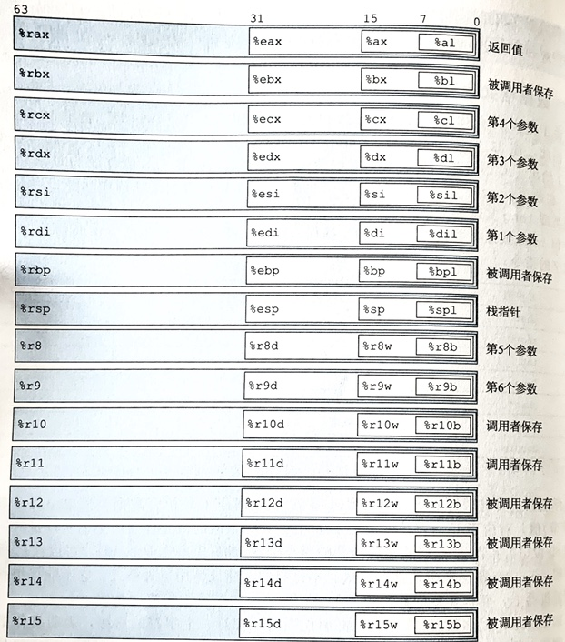
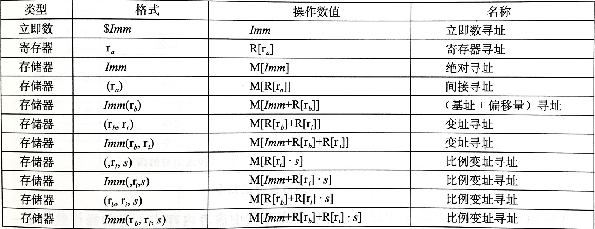
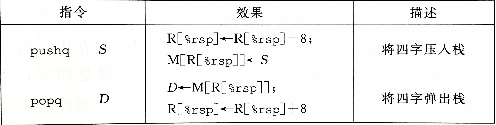
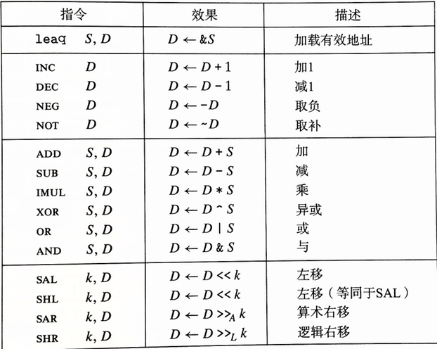
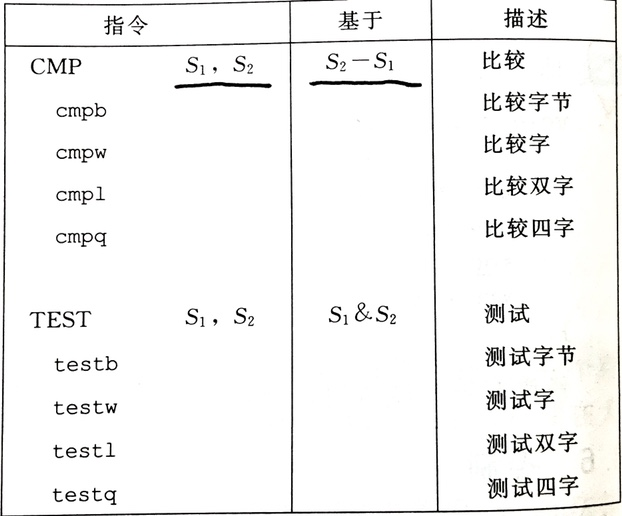
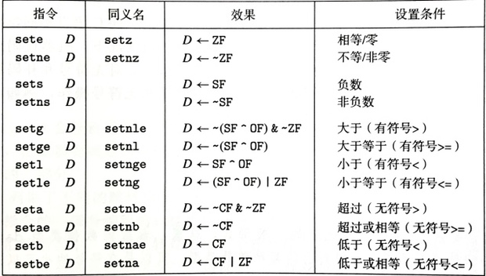
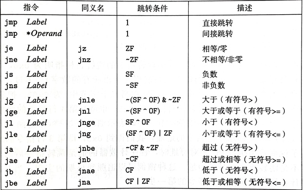
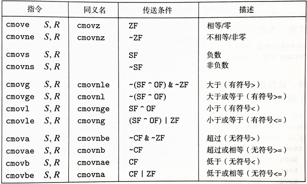
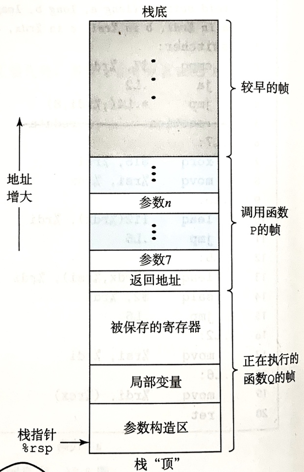

# 第3章 程序的机器级表示

## 寄存器和基本指令

### 通用寄存器



### 寻址模式



### 数据传送指令


`movl` 会把目标寄存器的高 4 字节设为 0。实际上任何更新低 4 字节的指令都会把高 4 字节置 0。

### 零扩展数据传送指令


没有 `movzlq`，因为 `movl` 功能相同。

### 符号扩展数据传送指令


### 栈操作指令



`%rsp` 始终指向栈顶元素。

### 算术操作指令



`leaq` 是 `movq` 的变形，看起来像是从内存中读数据到寄存器，但实际上将算出来的内存地址放到寄存器。

移位指令的移位量可以是一个立即数或 `%cl` 寄存器（单字节）。

### 特殊的算术操作指令


注意这里的乘法指令是单操作数的，并且是全乘法，而前面的是双操作数。

## 控制

### 常用的条件码


### 比较和测试指令



其中，`cmp` 指令和 `sub` 指令对状态寄存器的修改完全一致（注意两个操作数的顺序），但不会修改目标寄存器；`test` 指令和 `and` 指令对状态寄存器的修改完全一致，但不会修改目标寄存器。

### `set` 指令



`set` 指令的目标操作数只能是低位单字节寄存器（`%al` 等）或一个字节的内存地址，要产生 32 位或 64 位结果，需使用 `movzbl` 等指令进行零扩展。

注意不同 `set` 指令适用的数据类型（有符号、无符号）。

### 跳转指令



跳转指令的 PC 相对寻址：


反汇编第 2 行（地址 0x3）处的跳转指令编码中相对偏移 0x03 加上该指令的下一条指令开始地址 0x5 即为跳转目标地址 0x8；反汇编第 5 行（地址 0xb）处的跳转指令编码中相对偏移 0xf8（补码）加上下一条指令开始地址 0xd 即为跳转目标地址 0x5。

### 使用条件控制实现条件分支

```
if (test-expr)
    then-statement
else
    else-statement
```

翻译为

```
    t = test-expr;
    if (!t)
        goto false;
    then-statement
    goto done;
false:
    else-statement
done:
```

关于分支预测错误处罚的计算：设预测错误的概率为 p，没有预测错误的情况下执行时间 Tok，预测错误的处罚是 Tmp，平均执行时间 Tavg(p) = (1-p)\*Tok + p\*(Tok+Tmp) = Tok + p\*Tmp，随机情况下执行时间 Tran = Tavg(0.5) = Tok + 0.5\*tmp。

### 使用条件传送实现条件分支

```
v = test-expr ? then-expr : else-expr
```

翻译为

```
v = then-expr;
ve = else-expr;
t = test-expr;
if (!t) v = ve;
```

条件传送指令：



不是所有条件表达式都可以用条件传送来实现，因为使用条件传送的翻译方法要求对 then 和 else 表达式都求值，如果这两个表达式有副作用，则会出错，例如 `xp ? *xp : 0`。

### 循环

#### do-while 循环

```
do
    body-statement
while (test-expr);
```

翻译为

```
loop:
    body-statement
    t = test-expr;
    if (t)
        goto loop;
```

#### while 循环

```
while (test-expr)
    body-statement
```

翻译为

```
    goto test;
loop:
    body-statement
test:
    t = test-expr;
    if (t)
        goto loop;
```

这种翻译方法（跳转到中间）相比 do-while 增加了一个 `goto test` 从而跳过第一次无条件的循环体。

也可以翻译为

```
    t = test-expr;
    if (!t)
        goto done;
loop:
    body-statement
    t = test-expr
    if (t)
        goto loop;
done:
```

这种翻译方法（guarded-do）相比 do-while 在前面增加了第一次循环条件的判断，如果第一次条件满足，则后续相当于 do-while。使用这种策略时，编译器可以把初始的判断优化掉。

#### for 循环

```
for (init-expr; test-expr; update-expr)
    body-statement
```

翻译为

```
init-expr;
while (test-expr) {
    body-statement
    update-expr;
}
```

进一步可翻译为

```
    init-expr;
    goto test;
loop:
    body-statement
    update-expr;
test:
    t = test-expr;
    if (t)
        goto loop
```

或

```
    init-expr;
    t = test-expr;
    if (!t)
        goto done;
loop:
    body-statement
    update-expr;
    t = test-expr;
    if (t)
        goto loop;
done:
```

for 循环中如果用到 continue，直接翻译为 while 循环中的 continue 将会跳过更新表达式，应翻译为 `goto update`。

### switch 语句

注意区分 default 情况和多个 case 共用同一块的情况。

## 过程

栈帧结构：



### 转移控制

call = 返回地址压栈、跳转目标地址

ret = 返回地址弹出、跳转返回地址

### 数据传送

参数传递使用的寄存器：


超过 6 个参数时，多余参数从右向左依次 push 入栈，也就是说第 7 个参数在栈顶。通过栈传递参数时，所有数据大小向 8 的倍数对齐。参数所在的位置属于 caller 的栈帧，而不是 callee（被调函数）的。

## 数组

若有数组 `T D[R][C]`，类型为 T，行数为 R，列数为 C，则数组中第 $(i,j)$ 个元素的地址为 $\&D[i][j] = x_D + L(C*i+j)$，其中 L 为类型 T 所占的字节数。

数组访问的优化例子：

```c
int *Aptr = &A[i][0];
int *Bptr = &B[0][k];
int *Bend = &B[N][k];
int result = 0;
do {
    result += *Aptr * *Bptr;
    Aptr++;
    Bptr += N;
} while (Bptr ! Bend);
```

## 异质数据结构

### 数据对齐

对齐原则是任何 K 字节的基本对象的地址必须是 K 的倍数。

对于包含结构体的代码，编译器可能需要在字段的分配中插入间隙，以保证每个结构元素都满足它的对齐要求。

结构体本身对它的起始地址也有对齐要求（使能够满足每个字段的对齐要求），为了满足结构体对齐要求而填充的字节算入结构体的总大小（即使它后面接的是 char 类型的字段）。

例如：

```c
struct A {
    int a;
    char b;
    long c;
    char d;
}

struct B {
    struct A a;
    char b;
}
```

有 `sizeof(struct A) == 24 && sizeof(struct B) == 32`。

无论是结构体数组还是任何其它复杂的类型，其对齐要求最终目标是满足其内部每一个最基本元素的对齐要求。

## 值得注意的题目

所有
