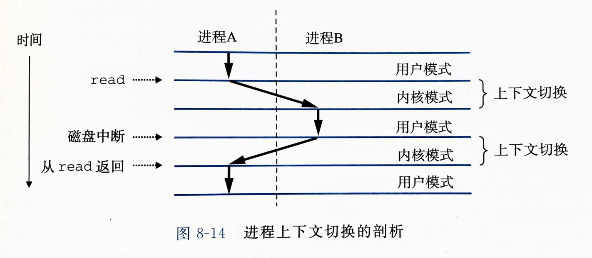

# 第8章 异常控制流（ECF）

- 硬件中断触发异常处理程序
- 内核切换用户进程
- 一个进程向另一个进程发送信号，触发信号处理函数
- 通过非本地跳转执行到其他函数的任意位置

## 异常

异常处理完成后，根据引起异常的事件类型，分为三种情况：

- 将控制返回给异常发生时正在执行的指令 $I_{curr}$
- 将控制返回给 $I_{next}$，即如果没有发生异常则应该执行的下一条指令
- 终止被中断的程序

异常和过程调用的不同之处：

- 过程调用时，在跳转到被调函数之前，将返回地址（下一条指令）入栈；异常时，返回地址可能是当前指令，也可能是下一条指令，也可能直接终止程序
- 异常时一些额外的内容会被压栈，比如 EFLAGS 寄存器
- 如果控制从用户程序转移到内核，内容被压到内核栈而不是用户栈
- 异常处理程序运行在内核模式

异常的类别：

系统调用属于陷阱异常（trap）。

虚拟内存缺页（page fault）属于故障异常（fault）。

## 进程

两个关键抽象：

- 独立的逻辑控制流
- 私有的地址空间

并发：两个逻辑控制流的执行在时间上有重叠。与处理器核数和计算机数无关。

并行：两个流并发地运行在不同的处理器核或计算机上。

进程上下文包括：通用寄存器、浮点寄存器、程序计数器、用户栈、状态寄存器、内核栈、各种内核数据结构（包括描述地址空间的页表、包含当前进程信息的进程表、包含已打开文件信息的文件表）。

上下文切换：

1. 保存当前进程上下文
2. 恢复某个先前被抢占的进程被保存的上下文
3. 将控制转移到新恢复的进程

上下文切换过程：

## 进程控制

进程的三种状态：

- 运行：要么在 CPU 上运行，要么等待被执行且最终会被内核调度
- 停止：被挂起，且不会被调度。当收到 SIGSTOP、SIGTSTP、SIGTTIN、SIGTTOU 信号时，进程就会停止，直到收到 SIGCONT 信号继续运行
- 终止：永远的停止。有三个原因：收到一个信号，该信号默认行为是终止程序；从主程序返回；调用 exit 函数

`fork` 创建的子进程得到与父进程用户级虚拟地址空间相同但独立的副本，包括代码和数据段、堆、共享库、用户栈，子进程还获得父进程打开的所有文件描述符副本。父进程和新创建的子进程最大的区别是有不同的 PID。

`fork` 调用一次，返回两次，父进程中返回子进程 PID，子进程中返回 0。

`waitpid` 如果参数 pid > 0，则等待单独进程，如果 pid = -1，则等待所有子进程。默认情况下挂起调用进程的执行，直到等待集合中有进程终止。

`waitpid` 的选项：

- WNOHANG：无论是否有子进程终止，都立即返回，如果没有终止，返回 0
- WUNTRACED：挂起调用进程，直到等待集合中有进程终止**或停止**
- WCONTINUED：挂起调用进程，直到等待集合中一个正在运行的进程终止或一个停止的进程收到 SIGCONT 继续执行

`wait(&status)` 等价于 `waitpid(-1, &status, 0)`。

`sleep` 让调用进程休眠，返回还剩下的要休眠的秒数，如果不是 0，那么可能因为 `sleep` 函数被信号中断了。

`pause` 让调用进程休眠，直到收到一个信号。

`execve` 从指定路径加载并运行一个新程序，会覆盖当前进程的地址空间，而不是创建新进程。新的程序有相同的 PID，且继承了原进程已打开的文件描述符。

`execve` 调用一次，从不返回。

## 信号

信号处理函数是用户层函数，是在用户模式运行的，而不是内核模式。

发出而没有被接收的信号称为待处理信号。对于一个进程，任何时刻，一种信号类型至多只会有一个待处理信号，接下来发送到这个进程的同类型信号会被直接丢弃，而不是排队等待。

一个进程可以选择性地阻塞接收某种信号。

待处理信号和阻塞是通过每个进程对应的一个 `pending` 和 `blocked` 位向量实现的。

`kill` 函数发送指定信号给其他进程（或自己），如果 `pid` 参数大于 0，则直接发给该进程，如果等于 0，则发给调用进程所在进程组中的所有进程，如果小于 0，则发给进程组 `|pid|` 中的所有进程。

`alarm` 函数安排内核在指定秒数后给自己发送 SIGALRM 信号，会取消之前已经设定的 alarm，并返回它还剩下的秒数，如果没有待处理 alarm，返回 0。

内核把进程从内核模式切换到用户模式时，检查未被阻塞的待处理信号，如果有，则选择一个接收。

不同信号的默认行为有：

- 进程终止
- 进程终止并转储内存
- 进程停止直到被 SIGCONT 重启
- 进程忽略该信号

SIGSTOP 和 SIGKILL 的默认行为不可修改。

`signal` 函数用来设置某个信号的处理函数。`handler` 参数 SIG_IGN 表示忽略，SIG_DFL 表示恢复默认行为。

信号处理函数返回时，返回到程序被信号中断时的下一条指令位置。

信号处理函数可以被其他信号中断，也就是说信号处理可嵌套。

隐式阻塞机制：内核默认阻塞当前正在处理的信号类型的待处理信号。

显式阻塞机制：可通过 `sigprocmask` 等相关函数来明确地阻塞和接触阻塞特定信号。

## 非本地跳转

`setjmp` 在 `env` 参数中保存当前调用环境，以供后面的 `longjmp` 使用，并返回 0。

`longjmp` 从 `env` 缓冲区恢复调用环境，然后触发最近一次 `setjmp` 调用再次返回，返回值为 `longjmp` 的 `retval` 参数。

`setjmp` 调用一次，返回一次或多次；`longjmp` 调用一次，从不返回。

## 值得注意的题目

P518-8.3、P520-8.4、P539-8.8、书后-8.10-8.11-8.12-8.13-8.14-8.15-8.16-8.18-8.21-8.23
