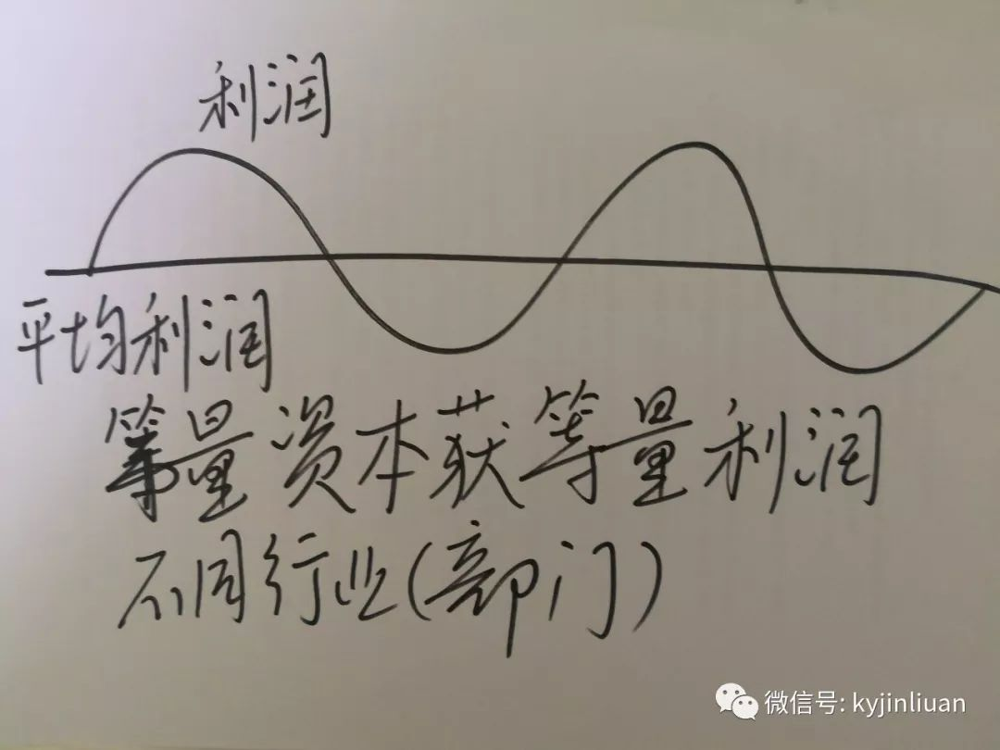

利润：资本家把全部预付资本的产物称作为利润。剩余价值是利润的本质，利润是剩余价值的转化形式。当剩余价值转化为利润时，剥削关系被掩盖了。

剩余价值转化为利润，剩余价值率就转化为利润率。利润率是剩余价值和全部预付资本的比率。**不同部门之间利润率不同，资本家之间展开激烈的竞争，使资本从利润率低的部门转向利润率高的部门，从而导致利润率趋于平均化，不同部门的资本家按照等量资本获得等量利润的原则来瓜分剩余价值。**在利润率平均化的过程中，形成了社会的平均利润率。**平均利润率是剩余价值总量对社会总资本的比率，即全社会的剩余价值总额和全社会的预付资本总额的比率。**

按照平均利润率来计算和获得的利润，叫做平均利润。随着利润转化为平均利润，商品价值就转化为生产价格，即商品的成本价格加平均利润。

