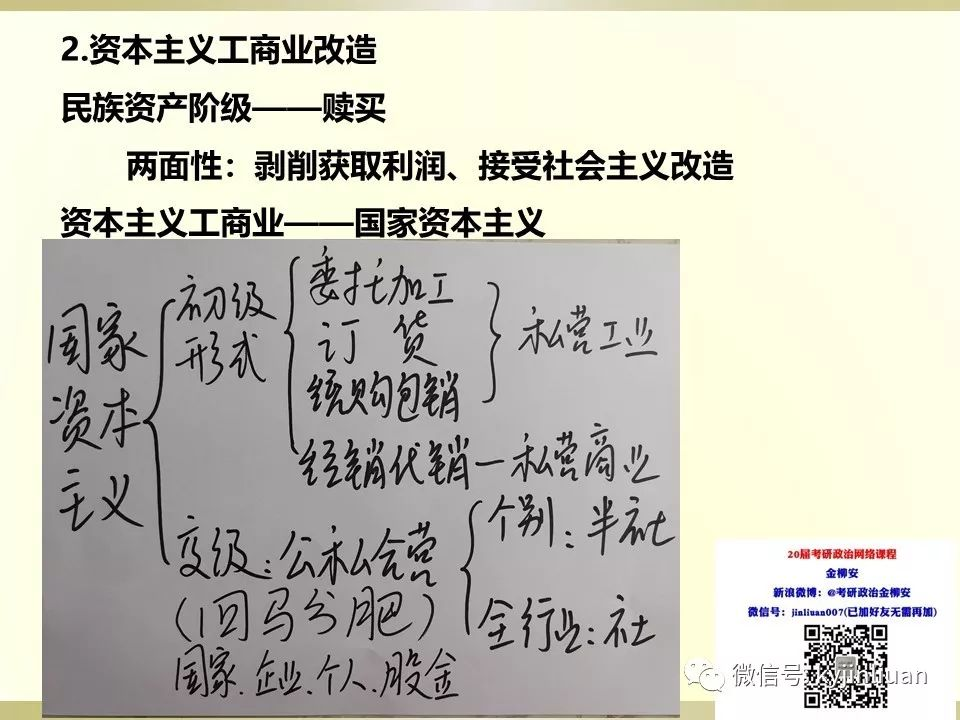

新中国成立后为进行现代化建设而进行的制度选择：

第一，提出国家工业化的任务；第二，选择社会主义工业化道路。从世界历史看，实现国家工业化，主要有两条道路：一条是资本主义工业化道路；一条是社会主义工业化道路。资本主义工业化道路在中国行不通。

提出过渡时期总路线的必要性：

一方面，随着民主革命遗留任务的彻底完成，国内的阶级关系和主要矛盾发生了深刻的变化。另一方面，随着国民经济的恢复和初步发展，中国社会的经济成分（即生产关系）发生了重要变化。

正是从以上两个方面变化了的实际情况出发，中共中央在 1952 年底开始酝酿并于 1953 年正式提出党在过渡时期的总路线，明确规定：“党在这个过渡时期的总路线和总任务，是要在一个相当长的时期内，逐步实现国家的社会主义工业化，并逐步实现国家对农业、对手工业和对资本主义工商业的社会主义改造。”

实行社会主义改造的必要性和条件：

国民经济恢复任务完成以后，当时中国之所以要着力进行和可能进行社会主义改造，主要是因为：第一，社会主义性质的国营经济力量相对来说比较强大，它是实现国家工业化的主要基础。第二，资本主义经济力量弱小，技术设备落后，资金不足，发展困难，不可能成为中国工业起飞的基础。第三，对个体农业进行社会主义改造，是保证工业发展、实现国家工业化的一个必要条件。第四，当时的国际环境也促使中国选择社会主义。
